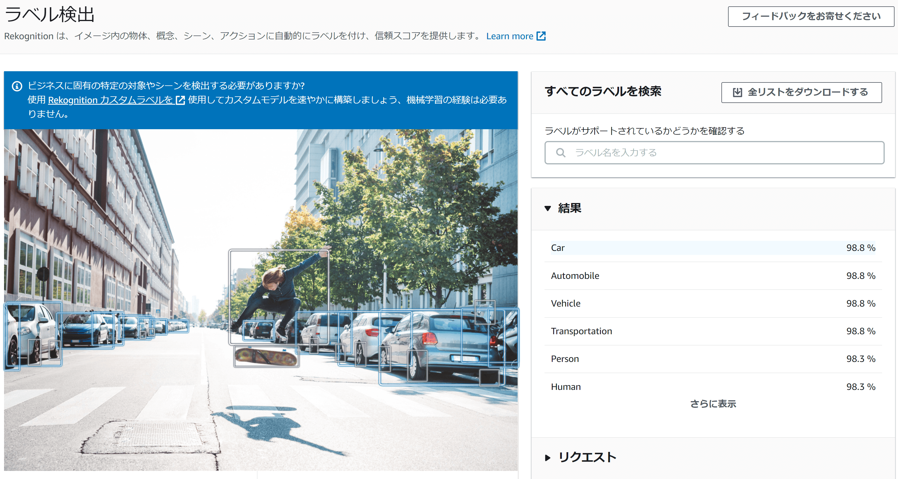

画像内のラベリング（写っているものが何なのかのタグ付け）や顔認識、顔の一致度比較程度なら [AWS Rekoginition](https://aws.amazon.com/jp/rekognition/) を使うと一瞬で実装ができます。

モデルの用意や学習などを一切行うことなく高精度な機械学習の成果を利用できるのは本当にすごいです。だいぶマイナーというかあまり取り沙汰されるサービスではないですが、めっちゃ安いしかなり素敵。



マネジメントコンソール上でできるのはデモだけです。実際の使用は AWS SDK か AWS CLI からの API 利用のみになります。

API リファレンスはこちら。  
[https://docs.aws.amazon.com/rekognition/latest/dg/API_Reference.html](https://docs.aws.amazon.com/rekognition/latest/dg/API_Reference.html)

ただ実際は各 AWS SDK のリファレンスを見たほうがわかりやすいです。（下記は Python）  
[https://boto3.amazonaws.com/v1/documentation/api/latest/reference/services/rekognition.html](https://boto3.amazonaws.com/v1/documentation/api/latest/reference/services/rekognition.html)

## detect_labels

今回は一般的な物体認識？といえるであろう `detect_labels` を例に挙げてみます。

```python
from boto3 import Session

session = Session(region_name="ap-northeast-1")
client = session.client("rekognition")

res = client.detect_labels(Image={
    "Bytes": file,
})
```

`"Bytes"` には base64 エンコードされた画像か、もしくは S3 から直接開いたオブジェクトを使用することも可能。バイナリなので普通にファイルオブジェクト的に渡すのも OK です。

```python
with open(mode="rb") as f:
    file = f.read()
    res = client.detect_labels(Image={
        "Bytes": file,
    })
```

レスポンスは下記のようになってます。

```json
{
    "Labels": [
        {
            "Name": "string",
            "Confidence": ...,
            "Instances": [
                {
                    "BoundingBox": {
                        "Width": ...,
                        "Height": ...,
                        "Left": ...,
                        "Top": ...
                    },
                    "Confidence": ...
                },
            ],
            "Parents": [
                {
                    "Name": "string"
                },
            ]
        },
    ],
    "OrientationCorrection": "ROTATE_0"|"ROTATE_90"|"ROTATE_180"|"ROTATE_270",
    "LabelModelVersion": "string"
}
```

`"Confidence"` にそのラベリングの信頼度みたいな値が百分率で入っているので、それを見つつ `"Labels"` 内で適宜自分が必要とするラベル名を取り出すのが一般的でしょう。

また、 `"BoundingBox"` には画像内における認識した物体の相対位置エリアを示す 4 つの値が格納されています。

これらはパーセント表示として扱えるので、例えば下記のようにそのまま CSS として利用できます。

<blockquote class="twitter-tweet"><p lang="ja" dir="ltr">新しいWebサービス作ってるニャウ... <a href="https://t.co/j46a0HVabA">pic.twitter.com/j46a0HVabA</a></p>&mdash; みるみ (@milmemo_net) <a href="https://twitter.com/milmemo_net/status/1439923570428104710?ref_src=twsrc%5Etfw">September 20, 2021</a></blockquote> <script async src="https://platform.twitter.com/widgets.js" charset="utf-8"></script>

ちなみに `"BoundingBox"` の中にも `"Confidence"` があるんですが、こっちは「バウンディングボックスの自信」らしいです。あまり値に差が出たことはない…。

同じノリで顔認証も楽にできます。こちらはあらかじめ顔画像を登録しておいて一致度の数値を見る…のような処理になります。しきい値の決定が迷いどころですかね。

## SAM ポリシー

Rekognition 自体は API ベースで使えるサービスのため SAM で使いたい場合にもテンプレート上でリソースを定義する必要はありませんが、ポリシーの定義を Lambda に持たす必要は当然あります。

AWS 側の[ポリシーテンプレート](https://docs.aws.amazon.com/ja_jp/serverless-application-model/latest/developerguide/serverless-policy-template-list.html#rekognition-detect-only-policy)を見ると `RekognitionDetectOnlyPolicy` というのがあるのでそれを使います。

```json
"Statement": [
    {
    "Effect": "Allow",
    "Action": [
        "rekognition:DetectFaces",
        "rekognition:DetectLabels",
        "rekognition:DetectModerationLabels",
        "rekognition:DetectText"
    ],
    "Resource": "*"
    }
]
```

先に見せておいてなんなんですがこれはもちろんインラインポリシーでは書かずに、

```yaml
Function:
    Type: AWS::Serverless::Function
    Properties:
      CodeUri: functions/
      Handler: app.lambda_handler
      Runtime: python3.8
      Policies:
        - RekognitionDetectOnlyPolicy: {}   # <-- これ
```

こう書きます。

SAM ポリシーテンプレート上で指定するポリシーには全てプレースホルダー値が必要ですが、仮にそれがなくても空のオブジェクトを指定すれば問題ないというのは実はドキュメントにも書いてあります（参考：[AWS SAM ポリシーテンプレート](https://docs.aws.amazon.com/ja_jp/serverless-application-model/latest/developerguide/serverless-policy-templates.html)）。
