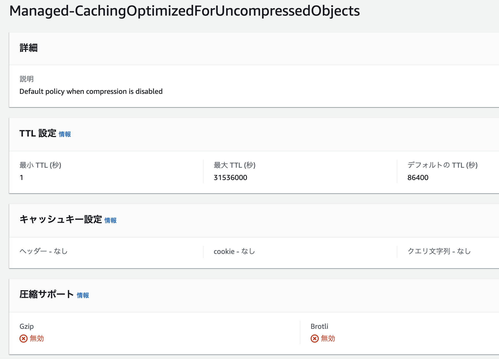
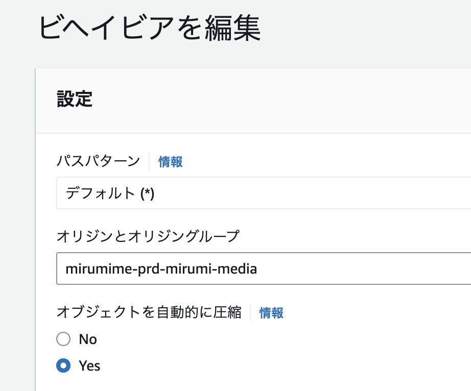

S3 に置いた画像などのバイナリオブジェクトを CloudFront で配信するとき、AWS が用意しているマネージドキャッシュポリシーから選ぶものを間違えると、なかなか気づけないまま単にキャッシュが機能しない状態になってしまうので記録に残しておく。

## キャッシュポリシー内の「圧縮」と「キャッシュ可否」は関連があるらしい

要点は、<strong>圧縮できないオブジェクトに対して「圧縮を有効化」しているキャッシュポリシーではキャッシュ自体が働かなくなる</strong>ということのようです。

つまり結論としては「Managed-CachingOptimizedForUncompressedObjects」を使うとワークする、になります。

*これ。*

下部の「圧縮サポート」がどちらもわざわざ無効になっているのが確認できます（キャッシュ部分の TTL 設定は通常のキャッシュポリシーと同じもの）。

それと、どうやら「キャッシュビヘイビア設定画面直下の『オブジェクトを自動的に圧縮』が Yes になっていることは問題ない」ようです。

*これ。*

初めてマネージドキャッシュポリシーの 5 つを見たとき、それぞれの有用性が全くわからなかったのですが、ちょっと腑に落ちました。そこは動いてよとは思うんだけども。

ちなみに、レガシーキャッシュセッティング（下図）のほうは使ったことがないので詳しい事情を知りません。少なくとも「レガシー」というくらいなのだから今後これを覚える必要はない気がしますが（たぶんそのうちなくなると思う）。
