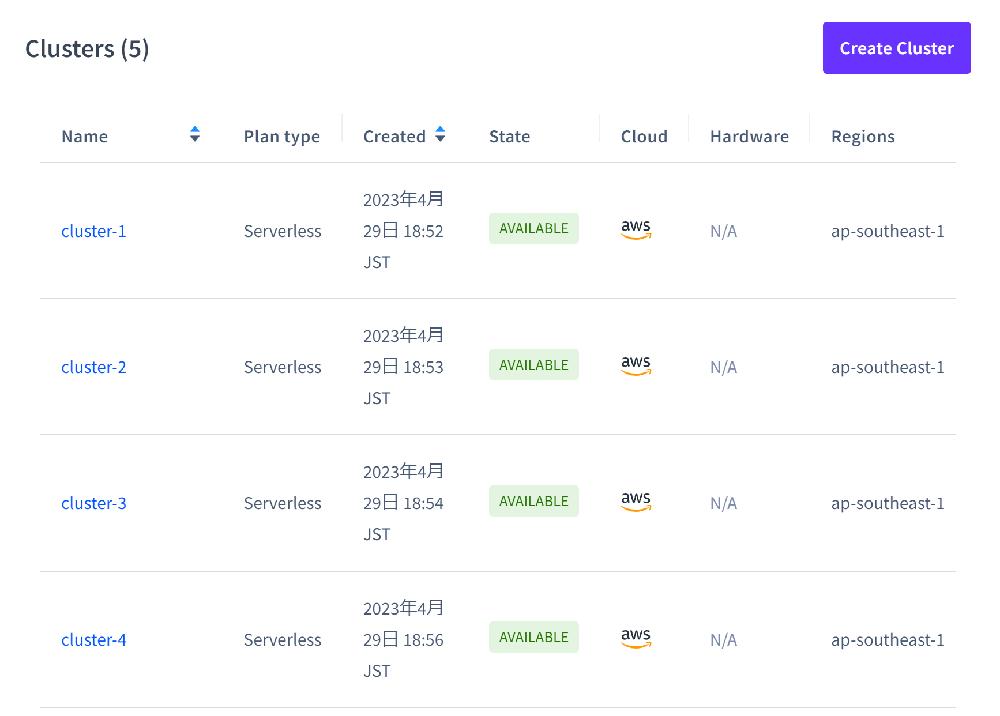

最近の個人開発では DB に [CockroachCloud Serverless](https://cockroachlabs.cloud/) を使っています。個人で PostgreSQL を使いたい場合のひとつの選択肢になるなーという感じで、わりとお気に入りです。MySQL だったら [PlanetScale](https://planetscale.com/) になるのかな。

Cockroach ◯◯ シリーズはサービスの全体構造がちょっとわかりにくいのですが、今回使うのはサーバーレスタイプの PostgreSQL で、中身は AWS の Aurora そのまんまを利用できます（ここも選んだ理由のひとつ）。日本リージョンは選べなくて、一番近いのは ap-southeast-1 になりますが、実用上困ることは（個人開発なら）ないでしょう。



で、実際にこの DB を使うためのコネクションを作る方法が非常にわかりづらく、公式のリファレンス通りにやってもダメ、Reddit の通りでもダメでだいぶ難儀したので記録しておきたいというのが本記事です。リファレンスやサービスページはものすごくしっかりしているんだけどな…。

## コネクションの作成（たぶん Lambda 用）

周辺コードは Python になってますが、問題なのはコネクションの文字列作成部分だけなので特に言語やクライアントを気にする必要はないと思います。

```python
CONNECTION = f"postgresql://{ユーザー名}:{パスワード}@{クラスター名}-{ランダムな 4 桁の数字}.{ランダムな文字列}.cockroachlabs.cloud:{ポート番号}/{クラスター名}-{ランダムな 4 桁の数字}.{データベース名}?sslmode=verify-full&sslrootcert=./root.crt"

conn = psycopg2.connect(CONNECTION, cursor_factory=DictCursor)
```

上記は、DB 作成後およびクラスターのページ右上にある [Connect] ボタンから見られるコネクション情報がベースになっています。「ランダムな 4 桁の数字」や「ランダムな文字列」の部分はそのコネクション情報から確認できるので適宜それを埋めてください。

差異があるポイントは 2 つで、

- データベース名の前に `{ポート番号}/{クラスター名}-{ランダムな 4 桁の数字}.` が追加されている
- cert ファイル（認証情報）の指定をコネクションに結合しないといけない

です。

前者はコネクション文字列前半で使っているものと同じ素材を使えばいいので特に問題はないですが、後者の認証情報の点は多少面倒が増えます。

先に注意点ですが、この項のタイトルにもあるように**後者の認証情報についてはたぶん Lambda から使いたいときのみ必要**な気がします。

というのも、コンソールページから見られる該当部分には

> If you haven’t already, you must have a valid CA certificate located at ~/.postgresql/root.crt. See instructions under ‘Download CA Cert (Required only once).

とあり、コンテナで運用するアプリケーションならここにある通り `~/.postgresql/root.crt` に配置すればわざわざ指定し直す必要はなさそうだからです。僕は試していないので「気がします」という表現に留めている次第です。

シークレット管理をローカルファイルでやらなければいけないのはかなり気持ち悪いし危ないのだけど、個人開発の範囲でならまあ許容できるかなと。もちろん同じ個人開発でもどの程度本気でユーザーを呼び込んだサービスにするかはピンキリなんですけども。

ひとつめの「データベース名の前に特定の文字列を追加する必要がある」は、色々実験してみましたが、ちゃんと接続できたのはこれだけでした。リファレンスやコンソールページも統一してもらえたらいいなと思います。
