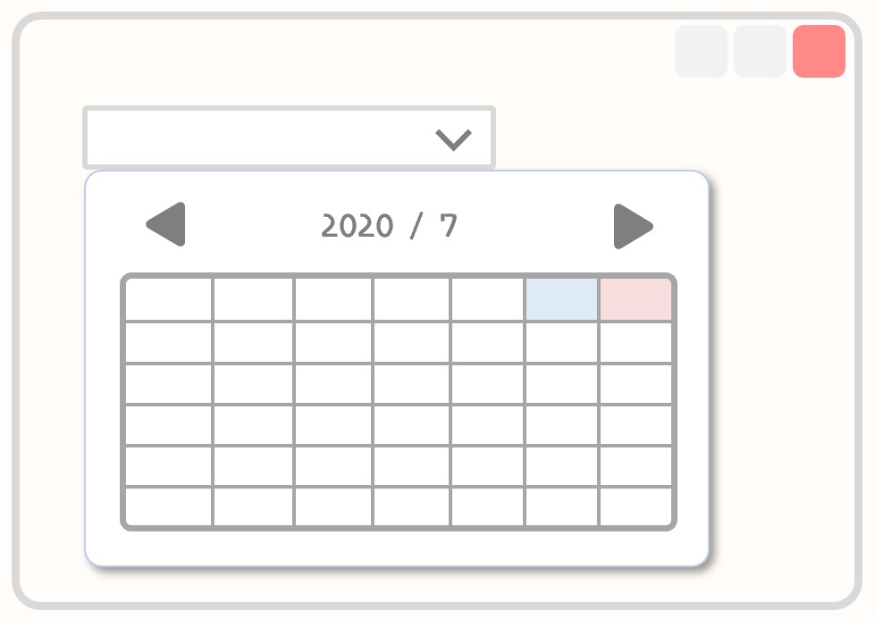

C# や VB で Windows 用デスクトップアプリケーションを作るときに使う「コントロール」の画像付き一覧が意外にもなさそうだったので自作してまとめてみました。

間違いなどありましたらページ上部にある GitHub リンクから修正リクエストをお願いいたします。  
※画像はすべてオリジナルなので無断転載はご遠慮ください

## 環境

- Windows 10 Home 64bit
- Visual Studio Community 2019, ver16.4.3
- .NET Framework, ver4.8.03752（コントロールリストの確認に使ったプロジェクトのターゲットバージョンは 4.7.2）

## .NET(C#/VB) の全コントロール一覧

アルファベット順です。

### BackgroundWorker

<pre class="language-no">クラス定義：System.ComponentModel.Component.BackgroundWorker</pre>

バックグラウンドで非同期処理を行うためのクラス。ダウンロードのような長い時間を必要とする処理を動かしつつ、UI の即時応答性は損ないたくない場合に便利。

### BindingNavigator

<pre class="language-no">クラス定義：System.Windows.Forms.ToolStrip.BindingNavigator</pre>

データバインディング先のデータを操作できる UI を表示する。BindingSource とセットで利用するのが基本。

### BindingSource

<pre class="language-no">クラス定義：System.ComponentModel.Component.BindingSource</pre>

データとフォームを紐付け、片方の変更をもう一方にも反映させる仕組み（データバインディング）を利用するためのデータセット。

### Button

<pre class="language-no">クラス定義：System.Windows.Forms.ButtonBase.Button</pre>

あらゆる操作のトリガーになる Windows 標準のボタンコントロール。最も利用機会が多いコントロールのひとつ。

### CheckBox

<pre class="language-no">クラス定義：System.Windows.Forms.ButtonBase.CheckBox</pre>

条件変数として使用可能なトグルボタンとなるチェックボックス。Button、RadioButton と並んで使用頻度が高い。

### CheckedListBox

<pre class="language-no">クラス定義：System.Windows.Forms.ListBox.CheckListBox</pre>

各項目の左側にチェックボックス付きで表示できるリスト。データの複数選択などの処理がある場合便利。ListBox の継承クラス。

### ColorDialog

<pre class="language-no">クラス定義：System.Windows.Forms.CommonDialog.ColorDialog</pre>

いつもの Windows 標準カラーピッカー。使い勝手はイマイチ。

### ComboBox

<pre class="language-no">クラス定義：System.Windows.Forms.ListControl.ComboBox</pre>

リストからユーザーが任意の値を選択できるコンボボックスを提供する。これも一般的なフォームコントロール。

### ContextMenuStrip

<pre class="language-no">クラス定義：System.Windows.Forms.ToolStripDropDownMenu.ContextMenuStrip</pre>

コンテキストメニュー、つまり右クリックメニューを実装するためのクラス。どのコントロール（Form）と紐付けるか指定するのを忘れないように。

### DataGridView

<pre class="language-no">クラス定義：System.Windows.Forms.Control.DataGridView</pre>

自由に加工可能なデータ一覧をグリッド形式（表）で表示できるフォーム。やや複雑だが便利。

### DataSet

<pre class="language-no">クラス定義：System.ComponentModel.MarshalByValueComponent.DataSet</pre>

アプリケーションがデータベースに常に接続しておかないようにする（非接続型モデル）ことを目的として、クライアント上で使用するデータをキャッシュとしてメモリに保管しておくためのクラス。主に ADO.NET で使われる。

### DateTimePicker

<pre class="language-no">クラス定義：System.Windows.Forms.Control.DateTimePicker</pre>

ユーザーが好きな日時を選択し、それを任意の書式で表示させるためのコントロール。

### DirectoryEntry

<pre class="language-no">クラス定義：System.ComponentModel.Component.DirectoryEntry</pre>

同じネットワーク上のデバイス（プリンタなど）やユーザーなど各種 AD（アクティブ・ディレクトリ）ドメインを扱うときに使用する。WinNT をはじめとする ADSI でデータの更新・読み取りなどにあたるような機能。

### DirectorySearcher

<pre class="language-no">クラス定義：System.ComponentModel.Component.DirectorySearcher</pre>

AD（アクティブ・ディレクトリ）に対して SQL のようなクエリを実行するためのクラス。名前の通りノードの探索に使う。

### DomainUpDown

<pre class="language-no">クラス定義：System.Windows.Forms.UpDownBase.DomainUpDown</pre>

文字列値を選択できるアップダウンコントロール（スピンボックス）を提供する。どちらかというと NumericUpDown で数値の上下をする方が一般的。

### ErrorProvider

<pre class="language-no">クラス定義：System.ComponentModel.Component.ErrorProvider</pre>

コントロールに対する入力エラーなどを通知するための UI。各コントロール要素でエラー説明文字列などを定義しておくと、表示速度や点滅可否等の設定とともにアイコンを表示できる。

### EventLog

<pre class="language-no">クラス定義：System.ComponentModel.Component.EventLog</pre>

Windows のイベントログへアクセスするための機能。EventLog クラスを使用するアプリケーションは管理者として実行する必要があることに留意する。

### FileSystemWatcher

<pre class="language-no">クラス定義：System.ComponentModel.Component.FileSystemWatcher</pre>

ファイルシステムの変更をウォッチし、ディレクトリやファイルの変更に気付くとそれをトリガーにしてイベントを発生させることができる。バッファオーバーランが起きやすい。

### FlowLayoutPanel

<pre class="language-no">クラス定義：System.Windows.Forms.Panel.FlowLayoutPanel</pre>

ウィンドウサイズなどに応じた動的なレイアウトが可能になるパネルインターフェース。非常に汎用性が高く、Web で言うレスポンシブデザインのようなニーズを満たせる機能。

### FolderBrowserDialog

<pre class="language-no">クラス定義：System.Windows.Forms.CommonDialog.FolderBrowserDialog</pre>

フォルダの選択ダイアログを表示させるためのクラス。「ファイルの選択」ではなく「フォルダの選択」専門であることに注意。

### FontDialog

<pre class="language-no">クラス定義：System.Windows.Forms.CommonDialog.FontDialog</pre>

ローカルにインストールされたフォント一覧を表示してユーザーに選択させるダイアログボックス。

### GroupBox

<pre class="language-no">クラス定義：System.Windows.Forms.Control.GroupBox</pre>

コントロール要素をひとかたまりにグループ化するためのもの。ラジオボタンの論理グルーピングに使われるのが一般的。

### HelpProvider

<pre class="language-no">クラス定義：System.ComponentModel.Component.HelpProvider</pre>

コントロールに紐付けたヘルプ内容を表示するためのプロバイダ。オンラインヘルプ（.html）やWindows の一般的なヘルプファイル（.chm）への参照を持つ。

### HScrollBar

<pre class="language-no">クラス定義：System.Windows.Forms.ScrollBar.HScrollBar</pre>

Windows 標準の水平スクロールバーを表示させる。

### ImageList

<pre class="language-no">クラス定義：System.ComponentModel.Component.ImageList</pre>

ListView や TreeView の補助的なコントロールで、画像をリスト化できるようにするためのもの。アイコンが並ぶような UI を作りたいときに使用する。

### Label

<pre class="language-no">クラス定義：System.Windows.Forms.Control.Label</pre>

フォーム上にテキストを表示させるための最もシンプルなコントロール。

### LinkLabel

<pre class="language-no">クラス定義：System.Windows.Forms.Label.LinkLabel</pre>

Label にハイパーリンクを付加したコントロール。ヘルプや作者サイト、Donate（寄付）ページなどのリンクを埋め込むのが一般的。

### ListBox

<pre class="language-no">クラス定義：System.Windows.Forms.ListControl.ListBox</pre>

リスト化された項目を表示するためのコントロール。リスト内の項目を検索する機能も実装可能。

### ListView

<pre class="language-no">クラス定義：System.Windows.Forms.Control.ListView</pre>

データをリストで制御できるコントロール。簡易的な DB のような使い方が可能で、メソッドやプロパティもかなり豊富。

### MaskedTextBox

<pre class="language-no">クラス定義：System.Windows.Forms.TextBoxBase.MaskedTextBox</pre>

フォームへの入力に際してバリデーション的なことができるテキストボックス。他言語によくある「各用途に応じたクラス（フォーム）」ではなく、この MaskedTextBox 内でプロパティを使い分けてバリデーション内容を変える。

### MenuStrip

<pre class="language-no">クラス定義：System.Windows.Forms.ToolStrip.MenuStrip</pre>

フォーム、つまりウィンドウの上部メニューにあたる部分を定義するためのコントロール。一般的。

### MessageQueue

<pre class="language-no">クラス定義：System.ComponentModel.Component.MessageQueue</pre>

メッセージキューサーバーのキューにアクセスするときに使用するラッパー的な要素。作成した MessageQueue オブジェクトで実際のキューへアクセスし、溜まっている通信を送受信するなど制御できる。

### MonthCalendar

<pre class="language-no">クラス定義：System.Windows.Forms.Control.MonthCalendar</pre>

月ごとのカレンダーを表示して日付を選択できるコントロール。

### NotifyIcon

<pre class="language-no">クラス定義：System.ComponentModel.Component.NotifyIcon</pre>

通知領域（タスクバー右下）に格納するときのアイコンを作成するコンポーネント。これ自体は UI を持たないので、ContextMenuStrip などと組み合わせて作成する。

### NumericUpDown

<pre class="language-no">クラス定義：System.Windows.Forms.UpDownBase.NumericUpDown</pre>

数値を上下させるスピンボックスを表示させる。これも一般的なコントロールのひとつ。

### OpenFileDialog

<pre class="language-no">クラス定義：System.Windows.Forms.FileDialog.OpenFileDialog</pre>

「ファイルを開く」ダイアログボックス。用意されているプロパティを使用すれば開くファイルの拡張子を指定したりすることも可能。

### PageSetupDialog

<pre class="language-no">クラス定義：System.Windows.Forms.CommonDialog.PageSetupDialog</pre>

印刷時の余白や用紙などの設定をするダイアログウィンドウ。利用するにはドキュメントに対してページ設定の初期化が必要。

### Panel

<pre class="language-no">クラス定義：System.Windows.Forms.ScrollableControl.Panel</pre>

コントロールをグループ化するためのもののひとつ。GroupBox との違いはキャプションがないこと、境界線がデフォルトでは非表示であること、スクロールバーを利用できることなどが挙げられる。ラジオボタンの論理グルーピングももちろん可能。

### PerformanceCounter

<pre class="language-no">クラス定義：System.ComponentModel.Component.PerformanceCounter</pre>

Windows NT でパフォーマンスカウンターを表示するためのコンポーネント。使用後は型を Dispose する必要がある。

### PictureBox

<pre class="language-no">クラス定義：System.Windows.Forms.Control.PictureBox</pre>

画像を表示するために使用する汎用的なコントロール。簡単な図線の場合は System.Drawing 名前空間で描画する方がパファーマンスが良い。

### PrintDialog

<pre class="language-no">クラス定義：System.Windows.Forms.CommonDialog.PrintDialog</pre>

プリンターと印刷するドキュメントの選択が行えるダイアログボックス。

### PrintDocument

<pre class="language-no">クラス定義：System.ComponentModel.Component.PrintDocument</pre>

印刷するときにどのドキュメントを対象とするのかを指定するときに使うクラス。前述の PrintDialog などと併用する。

### PrintPreviewControl

<pre class="language-no">クラス定義：System.Windows.Forms.Control.PrintPreviewControl</pre>

印刷プレビューのプレビュー部分本体を表すクラス。ボタンなどの UI は含まれない（PrintPreviewDialog とは別）ので、これを単体で使うことはあまりないと思われる。

### PrintPreviewDialog

<pre class="language-no">クラス定義：System.Windows.Forms.Form.PrintPreviewDialog</pre>

Windows 標準の印刷プレビューを使用するためのコントロール。ダイアログボックス（ウィンドウ）として UI を持つ。前述の PrintPreviewControl を内包している。

### Process

<pre class="language-no">クラス定義：System.ComponentModel.Component.Process</pre>

システムのプロセスにアクセスするためのクラスオブジェクト。ローカルとリモートどちらのプロセスも扱える。x86/x64 問題、使い終わったプロセスの解放などには注意する。

### ProgressBar

<pre class="language-no">クラス定義：System.Windows.Forms.Control.ProgressBar</pre>

Windows のプログレスバーを表示するコントロール。３つのバースタイルから好きなビジュアルを選べる。

### PropertyGrid

<pre class="language-no">クラス定義：System.Windows.Forms.ContainerControl.PropertyGrid</pre>

各コントロールのプロパティを表示するためのコントロール。これを使うと、開発者が Visual Studio のプロパティで好きにカスタマイズするのと同じようにユーザーがフォームを作り変えていける。

### RadioButton

<pre class="language-no">クラス定義：System.Windows.Forms.ButtonBase.RadioButton</pre>

グループ化された中から単一の値を選択させたいときに使う UI。GroupBox や Panel との併用が推奨される。

### RichTextBox

<pre class="language-no">クラス定義：System.Windows.Forms.TextBoxBase.RichTextBox</pre>

リッチテキスト形式のテキストボックスを表すコントロール。RTF ファイルを扱うことができるようになっているほか、各書式設定が利用できるようになる。

### SaveFileDialog

<pre class="language-no">クラス定義：System.Windows.Forms.FileDialog.SaveFileDialog</pre>

「名前を付けて保存」ダイアログボックスを表示するためのクラス。よく使う。

### SerialPort

<pre class="language-no">クラス定義：System.ComponentModel.Component.SerialPort</pre>

システムのシリアルポート関連の情報にアクセスするためのクラス。ピン状態なども取得できる。

### ServiceController

<pre class="language-no">クラス定義：System.ComponentModel.Component.ServiceController</pre>

実行中のサービスの情報取得や各種操作のために利用する。プロセスと似ているが違うもの。

### SplitContainer

<pre class="language-no">クラス定義：System.Windows.Forms.ContainerControl.SplitContainer</pre>

フォームを複数のペイン（パネルと呼んでいる）にサイズ可変状態で分割することができる機能。かなり汎用性が高く、FlowLayoutPanel とは違ったレスポンシブチックな UI を実装できる。

### Splitter

<pre class="language-no">クラス定義：System.Windows.Forms.Control.Splitter</pre>

前述の SplitContainer による分割線を単体で示すコントロール。これを単体で使うことは今はなく、互換性の問題だけで残されている。

### StatusStrip

<pre class="language-no">クラス定義：System.Windows.Forms.ToolStrip.StatusStrip</pre>

Windows におけるステータスバー（ウィンドウの下に張り付いて常に情報を表示するもの）を配置するためのコントロール。

### TabControl

<pre class="language-no">クラス定義：System.Windows.Forms.Control.TabControl</pre>

アプリケーションの設定画面でよく使われるようなタブ画面を実装できる。よく使う。

### TableLayoutPanel

<pre class="language-no">クラス定義：System.Windows.Forms.Panel.TableLayoutPanel</pre>

動的にレイアウトされるパネルのテーブル（表）バージョン。格納する値の文字列長が流動的なときに使うと効果的。コントロール自体の整列にも利用したい。

### TextBox

<pre class="language-no">クラス定義：System.Windows.Forms.TextBoxBase.TextBox</pre>

最も一般的なタイプのテキストボックスコントロール。これ１つでマルチライン対応やパスワードマスクまで対応できる。

### Timer

<pre class="language-no">クラス定義：System.ComponentModel.Component.Timer</pre>

指定したタイミングでイベントトリガーを発生させるために使うコンポーネント。シングルスレッド用の低精度なタイマーなので、より高精度なタイマーを必要とする場合は System.Timers 名前空間にある Timer クラスを使用すると良い。

### ToolStrip

<pre class="language-no">クラス定義：System.Windows.Forms.ScrollableControl.ToolStrip</pre>

標準的なツールバー（アイコンなどでショートカットを提供するもの）を実装するためのコンテナ。これまでに登場した各 Strip 系コントロールの基底クラス。

### ToolStripContainer

<pre class="language-no">クラス定義：System.Windows.Forms.ContainerControl.ToolStripContainer</pre>

ToolStrip をフォーム内の上下左右好きな場所に配置させるために使うパネル。

### ToolTip

<pre class="language-no">クラス定義：System.ComponentModel.Component.ToolTip</pre>

ユーザーがマウスポインターをフォーム上のコントロールにオーバーさせたとき、そのコントロールの説明をポップアップウィンドウで表示する。この仕組み自体をツールチップとも言う。

### TrackBar

<pre class="language-no">クラス定義：System.Windows.Forms.Control.TrackBar</pre>

スライダーのこと。特別な用途はなく「値入力のための普通のコントロール」なので、100段階での入力の場合などは同期した NumericUpDown とかを併設しておくと親切かも。

### TreeView

<pre class="language-no">クラス定義：System.Windows.Forms.Control.TreeView</pre>

エクスプローラーに代表されるようなツリー状のUIを提供するクラス。各ノードにオブジェクトを追加していくことで実装する。

### VScrollBar

<pre class="language-no">クラス定義：System.Windows.Forms.ScrollBar.VScrollBar</pre>

Windows 標準の垂直スクロールバーを表示させる。

### WebBrowser

<pre class="language-no">クラス定義：System.Windows.Forms.WebBrowserBase.WebBrowser</pre>

フォーム内で Web ブラウジング機能を提供するコントロール。あまり使い勝手が良くないので、素直に LinkLabel を使うアプローチなどを検討した方がいいかも。

## おわりに

見た目が貧相なので敬遠されがちだけれど、実は Windows フォームアプリケーションだけでも UI としてのユースケースは大抵カバーできることがよくわかります。WPF やら UWP やら WinUI 3 やら今は色々ありますが、これからも業務用ツールなどでシンプルな .NET アプリケーションの需要は絶えないでしょう。

この記事がもしお役に立ちましたら、シェアなどしていただけるととても嬉しいです。
