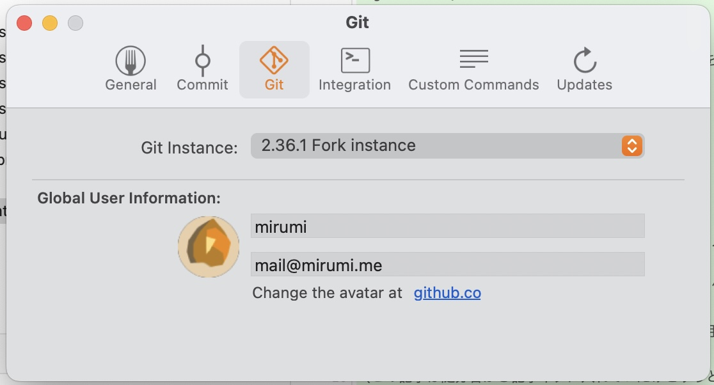
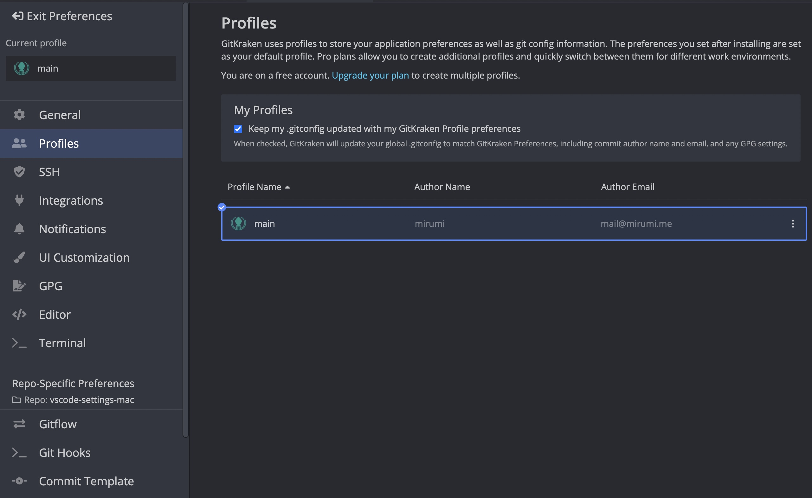

Git の GUI クライアントにはずっと SourceTree を使っていましたが、Windows 版で見過ごせないひどい有様があらわになったのを見て、よさそうなのを他に２つ試してみた記録です。

書くのは

- SourceTree
- Fork
- GitKraken

の３つです。Git を GUI クライアントで使用している人のほとんどはこの 3 つのうちのどれかに落ち着いているんじゃないでしょうか。

あとずっと気になってたんだけど、Git ってみんなどう使ってるのか全然知らない。エンジニアならみんな興味ありそうなネタなのにそういう記事とか特集も読んだことないのよなー。普通にターミナルからコマンド打つ人、VS Code 内蔵（かもしくは関連する拡張機能）のやつ、あとは GUI クライアントって感じですかね。この 3 つはどういう比率になるんだろう。

結果的には Fork が最高ということでその後ずっと愛用しています。

（この記事は随分昔から記事ネタに入れていたけどずっと書いていなかったものなので、比較をやったのはたぶん年単位で昔だしそれ以降は Fork しか使ってません）

## SourceTree

*[https://www.sourcetreeapp.com](https://www.sourcetreeapp.com)*

Git の GUI クライアントというとたぶんまずこれ。JIRA などで有名な Atlassian が開発元で、いまも一応継続的にメンテはされている。

Mac ではかなりの期間使っていたことがあって、その間は特に問題を感じなかったけど、Windows でも同じように使い始めようとしたときに色々と問題があることに気づいた感じ。

SourceTree のフォーラムには同様の報告やその他多くの報告（言葉悪いけどクレームに近かったかも）が寄せられており、しかもそれに対する Atlassian の対応は「直す気はないよ〜」みたいな感じで、スレッドに参加しているユーザーは「これらの問題を解決するのはごく簡単なことでした。SourceTree を使うのをやめて Fork に移行するだけです」みたいに言っていました。僕もそこで Fork を知り今に至ります。

SourceTree 内蔵の Git がたしかバージョンがすごい古くて、デフォルトブランチが master で出てきてしまったりした記憶がある。普通はクライアントをひとつ決めたら他のものを使うことはないと思うけど、作業の中でターミナルから使いたいことなどもあることを考えると、Apple Git ではないちゃんとした Git をひとつ入れてそれをどのクライアントでも使用するように統一するのが一番いいのかもしれない。

SourceTree 単体の話ではないですが、Fork と比較したとき<strong>ステージングされているファイル群とそうではないファイル群の表示位置が逆</strong>という差があり、乗り換えるときはここだけ（気持ちの）時間がかかりました。実害は特にないです。

### 気になってたところ

リポジトリの UI 画面でサイドバーの幅とかを調整すると思うんだけど、これの設定がリポジトリごとなのがしんどかった。

*こういうドラッグして UI のエリアサイズを変えられたりする系のやつのこと。*

例えば、左側のサイドバーはデフォルトでかなり細めになっているんだけど、これを新しいリポジトリを開くたびに手動でやらないといけなくてぐぬぬ…という感じだった。一応リポジトリごとに記憶はしてくれるけど、なんかの拍子にリセットされたことも結構あった気がして、僕はこの手の「自分が行った設定がリセットされる」系の現象に精神が耐えられないタイプなのでつらかった。

### Windows の問題

Windows で使い始めてすぐに驚いたのが、ファイルの変更検知が全く自動で動いてくれないという点。

自分は Windows での開発には WSL 2 を使うので完全にそのせいかと思っていたんだけど（WSL 2 はそれ単体でもファイル変更検知系がうまく働かない不具合の話題が多い）、全然そんなことはなく、Windows 側に置いているリポジトリでやってみてもだめだった。

同様の報告は多く挙がっていて、例えば下記。

[https://community.atlassian.com/t5/Sourcetree-questions/Refresh-doesn-t-work-at-all/qaq-p/705163]

Mac 側は変更検知はどうなってたかなと思って見直してみたけど、定期的に画面がリフレッシュされるような挙動があるのでポーリング？に思える。間隔はかなり狭いからいいけど画面を開いているときにずっと落ち着かない感じがちょっとある。

その他コミットコメントのグローバル設定などでいくつか小さめの問題もあった気がしたのと、Mac では比較的見やすくて洗練されていたインターフェースが Windows では残念なことになっていたのを見て次へ行きました。

### 設定項目

設定画面のスクショだけ載せておきます。

## Fork

*[https://git-fork.com](https://git-fork.com)*

この記事が記事ネタに入って以降ずっと使っているクライアント。致命的な問題は全くないし（小さな不具合をひとつだけ [issue tracker](https://github.com/fork-dev) で報告したことがあるけど直してもらえた）、無料で使用していても機能制限は一切ありません。極稀に「ライセンス買ってね！」のやつが出ますが、広告のような煩わしさは一切ない。もしこの記事を読んで Fork を使い始め、そして気に入った方がおられたらぜひ寄付の検討をしてみてください。いいソフトはみんなで応援したいです（もちろん僕も買っています）。

唯一不安点があるとすると今書いたように開発が個人の方であることくらい。これは開発のリソースとして不十分という意味ではなく、突然のサ終がないかのリスクの話。だからこそ金銭的な援助が重要になると考えています。実際のところアップデートは日頃かなり頻繁に行われています。issue tracker はちょっとパンクぎみだけどね…（オープンソースではないので他の開発者がコミットで支援することはできない）。

一番長く使っているので Git の機能は一通り触ったことがあると思うけど、特に困ったシーンは思い浮かばない。複雑なことがしたければターミナルを開けばいいのでそれも特に問題なし（ターミナルを開けるのは SourceTree も同じ）。もちろん Mac 側で Git インスタンスの設定をやっておかなければならないのはさっき上で書いた話です。

あと言い忘れてましたが、外観のテーマ（ライト/ダーク）は今回の 3 つともどれも選択が可能です（システム設定の同期もある）。

### ファイルウォッチャーがいい感じ

Mac でも Windows でもファイルウォッチャーは同等に機能します。ついでにいうと WSL 2 内にあるリポジトリも全く問題なく読んでくれるので最高です。

ポーリングしているというより、アプリケーションがフォーカスされてアクティブになるとその場でフェッチしているような印象を受ける。別に時間がかかるわけではないので無駄がなくて僕は好きです。リモートの fetch に関しては頻度指定をすることはできず、「Fetch remotes automatically」の設定のみです。SourceTree は分単位の指定ができます。

### Windows 版でのマウススクロールの挙動が惜しい

一箇所気になっていることがあって、Windows 版のみ下記エリアでファイルの内容などを見たくてマウススクロールをしようとするとき、エリアのタブがぐるぐる切り替わってしまってスクロールできないという問題があります。毎回これ笑っちゃうんだよな。

*この画面でいうと「Commit」「Changes」「File Tree」がひたすら切り替わりまくる感じ。*

たしかに issue を出した記憶があるんだけど、見つからない…。これは改善されると嬉しいな。

### 設定項目

## GitKraken

*[https://www.gitkraken.com](https://www.gitkraken.com)*

見た目がすごそうで気になってたのと、GitHub の色んな機能がクライアントから使えそうなのがすごそうで触ってみました。下記に書く問題点 2 つがなければメインで常用していたかも。アプリケーションの体験はものすごく良いのでなんか惜しいなあという感じ。

### 問題点

致命的だったのは、「コミットごとの変更内容を同じ画面内で確認できない」というところでした。

このコミット一覧の画面で、

各コミットをクリックしたら上下左右の半分とかが変更内容を示すエリアになってもよさそうだけど、

こんな感じで毎度画面全体が切り替わってしまう。

しかも変更内容は最初の画面右側に表示される各ファイルのほうをクリックしないといけなくて（画像矢印部分）、つまり複数ファイルの変更を見たいときはいちいちクリックして戻って…みたいになる。これはちょっと普段使いできないと感じた。

これもし使い方でなんとかなる問題だったらぜひ教えてください…！

問題点 2 つめ、重いというか遅い。

各タブを切り替えるたびに作業の集中力が一瞬ウッと途切れるような遅さがあり、新しく開くタブに関してはガッツリロードが入ります。普段からハードユースする実作業ベースのツールではどんなにインターフェースがよくてもレスポンスのほうが重要視されてしまうんだなあということを改めて認識した。単純に多機能すぎてパフォーマンスが落ちているんだろうか。

### 設定項目

## まとめ

おすすめは Fork です。みんなで応援しましょう。
