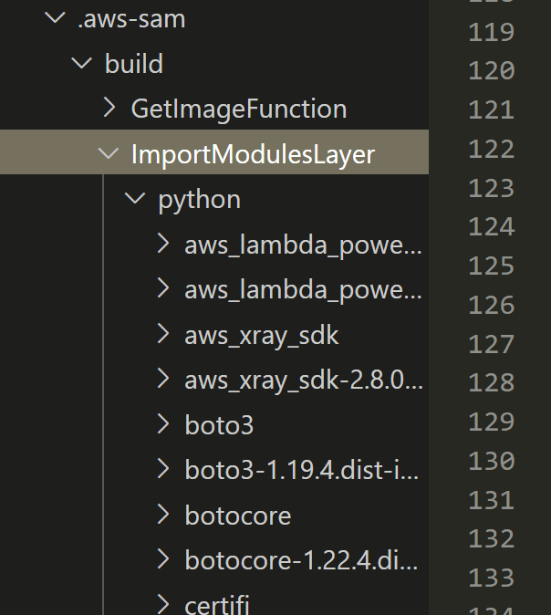

Lambda の各関数ディレクトリの中にある requirements.txt の中に依存モジュールを書くのではなく、空のレイヤーをつくってそこに requirements.txt だけ書いて置いておこうという話です。

## なんで？

例えばランタイムで Python を選択したときの下記のような `sam init` 後のディレクトリ構成にて、

```bash
root
│  .gitignore
│  README.md
│  template.yaml
│
├─ events
│  event.json
│
└─ hello_world
    │  __init__.py
    │  app.py
    │  requirements.txt  # --> ここに依存モジュールを書きがち
    │
    └─ tests
        │  __init__.py
        │  requirements.txt
        |
        ├─ integration
        |  __init__.py
        |  test_api_gateway.py
        |  
        └─ unit
           __init_.py
           test_handler.py
```

Lambda 関数のロジックとなるソースファイルが 1 つしかないのでつい hello_world 内の requirements.txt を使ってしまいがちです。

この場合に考えられる問題は下記のような感じでしょうか。

1. 他の関数ディレクトリから共通して使用する外部モジュールがあった場合、それぞれがデプロイパッケージを作成して通信するため色々無駄が多い
2. SAM 側で定義する 1 つの Function 単位でデプロイパッケージが大きくなりすぎる場合、Lambda のマネジメントコンソール上でコードを参照できなくなる

①に関してはただ無駄なだけならまだいいんですが、SAM の資材として置き場になる S3 の容量も専有すること、毎回のデプロイ所要時間が伸びてしまうこと、など色々困りポイントがあります。

そして②の問題がかなりやっかいで、気軽な print デバッグやコード参照がこれだけのために無効化されるのは避けるべきと思えます。

 
*こうなる。*

これらのせいか、AWS 側でも外部モジュールの使用に際してのベストプラクティスとしてレイヤーの利用を [推奨しているっぽい](https://docs.aws.amazon.com/ja_jp/lambda/latest/dg/gettingstarted-package.html#gettingstarted-package-layers) です（自分も今回はじめて気づいた）。

この辺りの仕組みが実際どうなっているのかは、 `sam build` したあとにプロジェクト内に出来上がる `.aws-sam` ディレクトリを見ることで様子が伺えます。デプロイするときに使われる一時的なファイル群で、最後にビルドしたときの状態がそのままデプロイに利用されていると思って問題ないと思います。

```bash
.aws-sam/
├── build/
│   ├── function_1
│   ├── function_2
│   ├── function_3
│   └── template.yaml
└── build.toml
```

build ディレクトリ以下にビルドされた各関数ディレクトリが並んでおり、依存モジュールを必要としている場合はそれらの実体も含まれているのがわかります。



実際に `ImportModulesLayer` というレイヤーに束ねて外部モジュール依存を記述してみると、ここに色々溜まっているのが見て取れますね。

テンプレート的には下記のようになると気持ちいいでしょう！

```yaml
Resources:
  MyFunction:
    Type: AWS::Serverless::Function
    Properties:
      FunctionName: my_function
      CodeUri: function_1/
      Handler: app.lambda_handler
      Runtime: python3.9
      Layers:
        - !Ref ImportModulesLayer  # --> これ
```

おわり。
