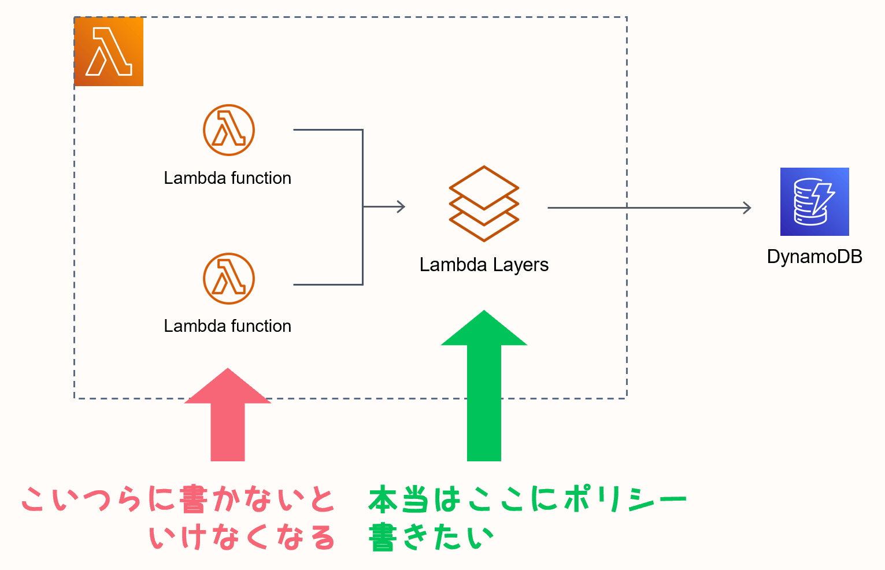

Lambda 同士で共通の処理を切り出せる [Lambda Layers](https://docs.aws.amazon.com/ja_jp/lambda/latest/dg/configuration-layers.html) は一見とても便利に見えますが、実際に使う場合は使用方法をよく吟味しないと使う前よりかえって不便な結末になる、ということがあります。

その結果工数をかけてまでわざわざレイヤー化したものをもとに戻したこともあります。このときの経験が本記事のベースにあります。

備忘録を兼ねてデメリットをまとめます。

## 前提

- 運用は [SAM](https://aws.amazon.com/jp/serverless/sam/)
- 言語は Python
- けっこう大規模なアーキテクチャ（ネストスタックなどあり）
- このアーキを触る主な開発人員は 3～4 人

## ポリシーや権限などをレイヤーを呼ぶ Function やスタックに持たせないといけない

これは「不便」や「面倒」といった僕らの精神的側面とは全く違う問題だと思っていて、**本来必要としていないリソースに無駄な権限付与や環境変数付与をしないといけなくなる**のがかなり気持ち悪かったんですよね。

図にするとこう。

 
*この図だけだとあまり伝わらない気がするのですが、実際はスタックで分かれていたりするのでもっと大変な感じでした。*

レイヤーは Lambda と名前こそつくものの、実態としてはインポートするモジュールのようなものに過ぎません。つまりそれを行使する Lambda Function に実際のパラメータを付与しないといけなくなり、SAM のテンプレートもだいぶめちゃくちゃなことになります。

これはネストスタックを使っているとさらに混乱することになります。「全然必要としていないヤツにも VPC のセキュリティグループが付与されている！」とかなるわけで、真面目に設計するならこの時点で何かを変えないといけません。

:::info
最後にちょろっと書いたんですが、たぶんレイヤーの想定用途としてこういうシーンは考えられていないんじゃないかなーと今は考えています。
:::

## マネジメントコンソールから Lambda 関数として気軽にさわれない

実際の実装はローカルの好きなエディタでやるとはいえ、

- デプロイしたあとにちょっと print デバッグをしたい
- 動作確認のためにデプロイ環境上でだけ特定範囲をコメントアウトしておきたい

みたいなシーンは必ずあります。

そんなときサクッとマネジメントコンソールの Lambda を開いてソースを直で触れるのはやはり便利です。どうせそのあとデプロイしたり CI/CD が動いたりしたらちゃんと正常状態に上書きしてくれるわけだから気も楽だし。

ところがレイヤー化してしまった部分は単一の Lambda Function としては触れなくなるので、こういった GUI 上での気軽なデバッグができなくなります。

## ログを見に行くのがちょっとダルい

これも正しいレイヤーの使い方から外れているからな気がするんですが（後述）、**CloudWatch でログを見たいときに単体の関数として閲覧できない**というのも挙げられると思います。

当然レイヤーを呼んだ Lambda のログストリームとして探しに行くことになるので、そのアプリケーションならではの処理をレイヤーに切り出したときは「これなんか思ってたんと違くね…？」ってなりがち（DB 接続みたいな本当の汎用的な処理を切り出す分にはこの限りではないと思います）。

でこのあたりで気づいたわけですが、**たぶんレイヤーの想定されている用途は本当に汎用的な処理だけを書くもの**なんでしょうね。アプリケーション全体で使われるから～みたいな感じで関数として切り出すイメージだとたぶんデメリットばかり気になる感じ。

とはいえわざわざ共通化を検討していたということはそこそこな内容のものではあるはずだし、全部が全部 DB 接続とか通信処理とかではないよなーとも思います。

ベストプラクティス知りたい。

## （追記）

外部モジュールを使用するとき、各デプロイパッケージ内の requirements.txt に書くのではなくインポート用だけのレイヤーを作るといいよ、という記事を書きました。これは AWS も推奨しているソリューションのようです。

- [Lambda(SAM) の外部モジュールインストールには Layer の requirements を使おう](https://mirumi.me/tech/153/)

## さらに追記

最近は複数 Functions にまたがる定数の定義やいわゆる util/ に置くようなものをレイヤー化することで上手に使えるようになりました。

このサイトのリポジトリでも使っているのでよければご覧ください。

[https://github.com/mirumirumi/mirumi-tech-backend]

加えて、ひとつ前の追記で書いたように「特定の関数用のインポートモジュール用レイヤー」というのもよく使うようになりました（Lambda はパッケージサイズが大きすぎるとコンソールでコード閲覧ができなくなるので困るのだけどそれを防げる）。
