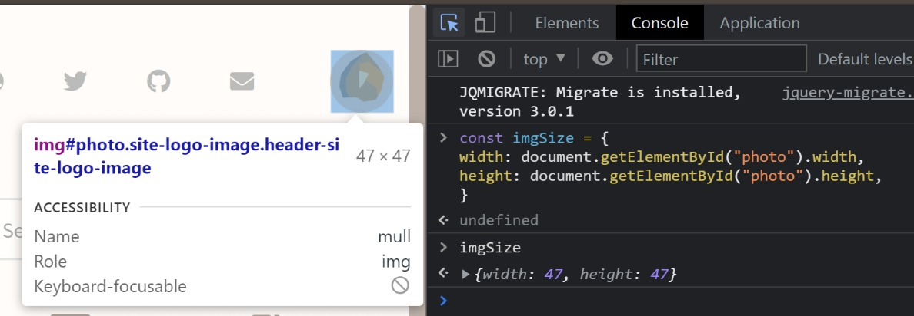
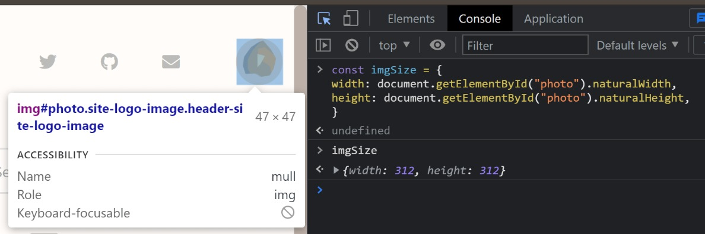

HTML 上から画像を指定してサイズを取得するとき、

```js
const imgSize = {
    width: document.getElementById("photo").width, 
    height: document.getElementById("photo").height,
}
```

とやりがちですが、対象が画像の場合はビュー上のレンダリングサイズになってしまいます。



画像の実寸サイズを取得したい場合には `naturalWidth`/`naturalHeight` というプロパティが使える模様。  
参考：[MDN](https://developer.mozilla.org/en-US/docs/Web/API/HTMLImageElement/naturalWidth)

```js
const imgSize = {
    width: document.getElementById("photo").naturalWidth,
    height: document.getElementById("photo").naturalHeight,
}
```



サイトアイコンの 312px が取得できていることがわかります。
