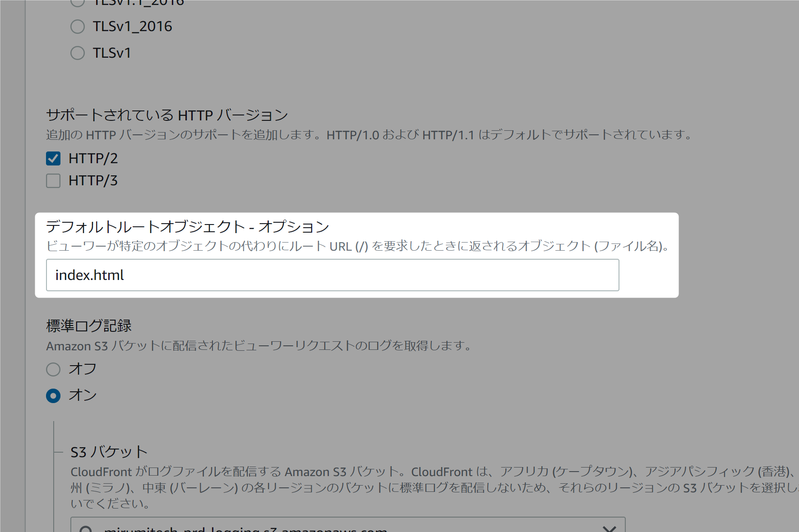
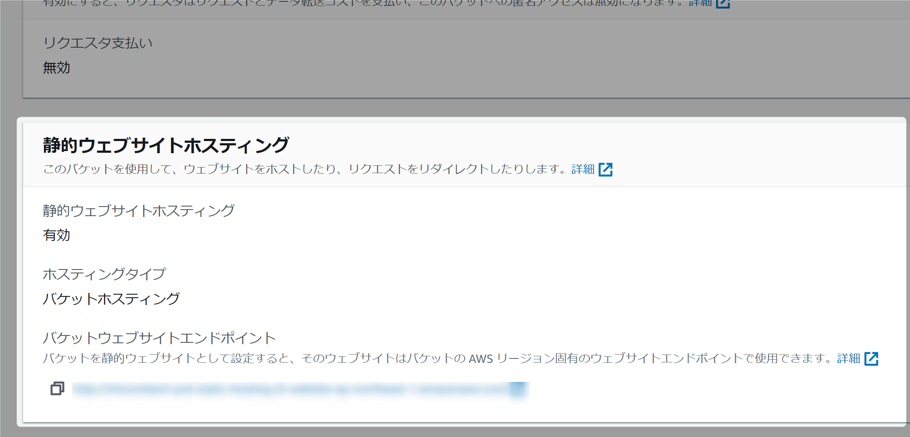
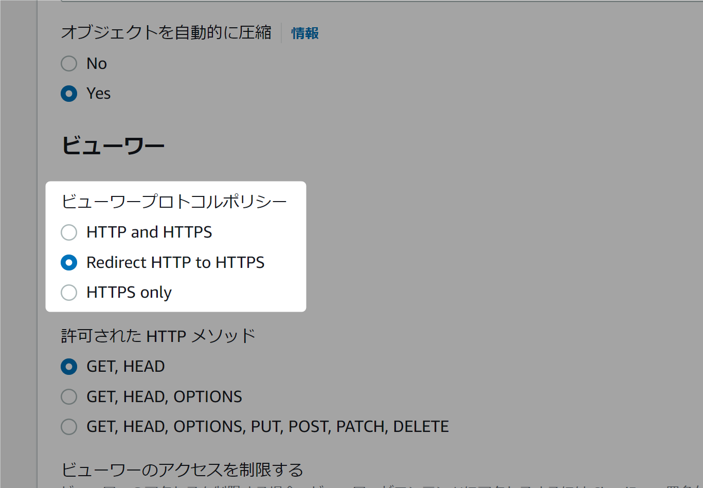
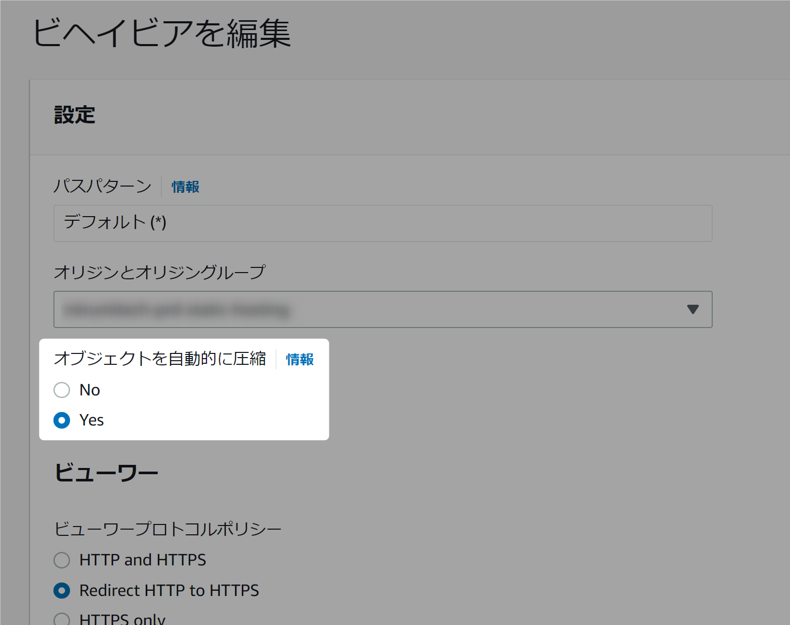
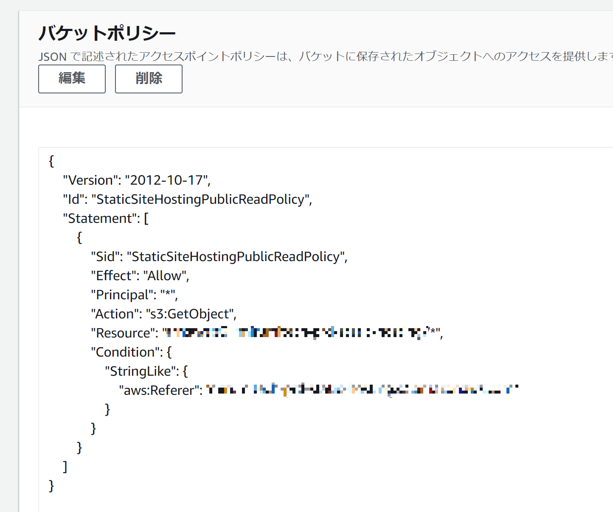
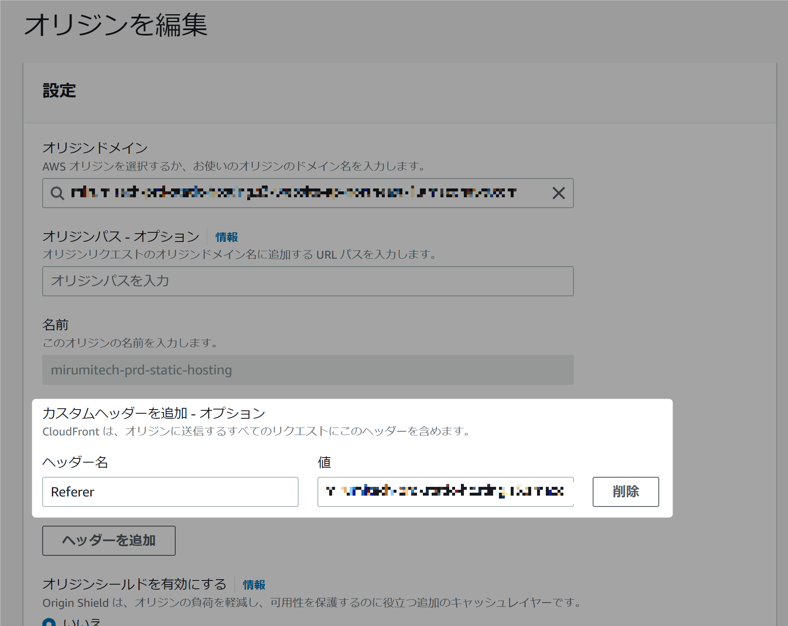
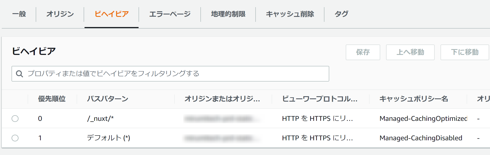
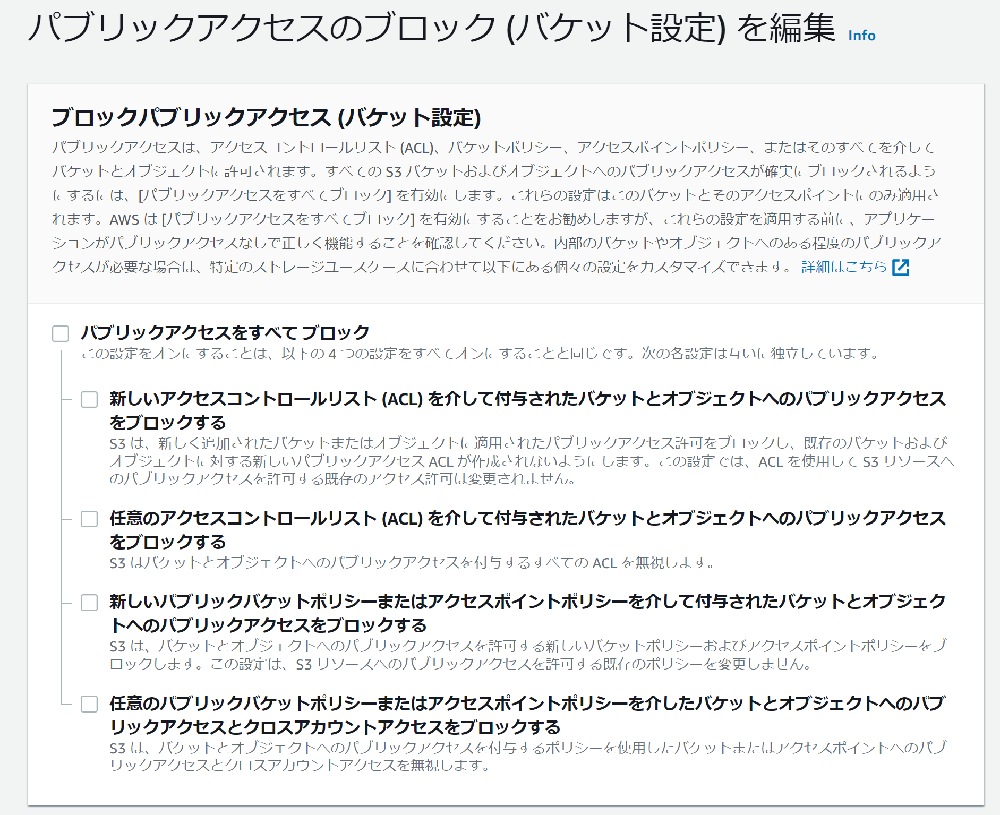

Nuxt 3 で SSG したビルド成果物を AWS に IaC でデプロイするまでの一連の流れを記録しておく。

S3 と CloudFront の各設定、キャッシュ制御、それらの CloudFormation 上での記載方法などが主な内容です。

ちなみに本サイト（mirumi.tech）も今回取り上げる構成で作られています。気になる方は下記の記事もご覧ください。

[/this]

## 使うもの、環境など

- Nuxt@3.0.0-rc.6 ~ 正式バージョン
    - 初ビルドは rc6 で、その後逐次バージョンアップして最終的にはちゃんと正式バージョンにまで上げたが特に変わったことはなし
- S3
    - 静的ウェブサイトホスティング機能を使う（理由は後述）
- CloudFront
    - パブリックアクセスを実現させるためだけなら S3 だけでも事実上可能だが、基本的には CloudFront を使わない理由がない
        - CDN なのでパフォーマンスでは完全にメリットしかない
        - ログやアラームをつけられる
        - 細かなセキュリティ制御
        - WAF などその他機能を付加できる
        - 無料（個人の範囲ではまず有料ラインまで届くことはない）
- Route 53 と AWS ACM
    - 任意ドメインでデプロイするために使う
    - 今回は割愛します（これらは Terraform で書いているので、機会があれば別記事を書きます）
- CloudFormation
    - 個人のお好みではありますが IaC なしで AWS を使うことは基本的にはない
    - Terraform でも今回とほぼ同じ構成のものを書いたことは何度もあるけど、特に CloudFront は階層構造的に yaml のほうが書きやすくて見やすい印象があった（むしろ CloudFormation でちゃんと書いたのが初めてだったのでこの記事を書いている）

### Nuxt 3 の設定状態（nuxt.config.ts）

基本的には何もしなくても `npm run generate` ってやればいい感じになるので特に細かい設定は不要と思われます。

関係ありそうなところだけ抜粋して掲載します。

```ts
import { defineNuxtConfig } from "nuxt"

export default defineNuxtConfig({
  pages: true,  // 指定した src ディレクトリに pages ディレクトリがあれば明示は不要
  ssr: true, 　 // これもデフォルトで true
})
```

本当に書く必要なかったかもしれない…。

## 実現させたい設定

やりたいことは以下です。

- URL で自分のサイトにアクセスできるようにする
- ドメインルート直下以外のページにダイレクトアクセスしても 403 にならないようにする（ここ重要）
- HTTP -> HTTPS のリダイレクト
- URL 末尾の `/` を表示したくない
- ブラウザキャッシュと CDN キャッシュ（= CloudFront のキャッシュビヘイビア）の適切な設定
- gzip 圧縮を有効化させる（実際にはほぼ Brotli というさらによいものが使われることになります）
- S3 のエンドポイントに直接アクセスされたときに弾けるようにする

１つずつ軽い説明 & マネジメントコンソール上でどこの設定に該当するかを紹介します。

### URL で自分のサイトにアクセスできるようにする

これは言うまでもないです。すなわち静的アセットをホスティングするということにほかならないです。

### ドメインルート直下以外のページにダイレクトアクセスしても 403 にならないようにする

通常の S3 + CloudFront 状態での配信だと<strong>ルート直下の index.html しか正常に表示してくれません。</strong>

CloudFront には下図のようにデフォルトで index.html を表示してくれるようなオプションがあるので見逃しがちですが、これは書いてあるように「ルート URL (`/`) のみしか反応しない」です。


*ディストリビューションのメインの [設定] 画面。*

つまり S3 の my-backet に my-entry-1/index.html というオブジェクトを配置していた場合、https://mydomain/my-entry-1 でアクセスできることを期待するもののその結果は 403 となってしまいます。

これを回避するために S3 の機能である「静的ウェブサイトホスティング」を有効化します。このためだけではなく、以降で書く他の目的も同時に（自動で）達成してくれるため、基本的にはこれが一番おすすめだと思います。


*S3 バケットの設定→ [プロパティ] タブの一番下にあります。*

唯一のデメリットとして S3 のエンドポイントに直接アクセスできるようになってしまうのを自分で塞ぐ必要がありますが、これは IaC を一度書いてしまえばもう忘れていいくらい大したことない設定です。後述します。

:::info
静的ウェブサイトホスティングを使わない通常の S3 + CloudFront のベストプラクティスは「オリジンアクセスアイデンティティのみからのアクセスを許可する」でしたが、つい最近（2022年8月）、新しい発表が AWS からありました。

[https://aws.amazon.com/jp/blogs/news/amazon-cloudfront-introduces-origin-access-control-oac/]

さっと読んだ感じすぐさま対応しなければならないほどのメリットを享受できるケースは多くなく、もっというと今の OAI のままでも別に危険ということはなさそうです。しかし今後の推奨パターンがこの OAC（オリジンアクセスコントロール）になることを考えると、早めに慣れておいたほうがよさそうです。
:::

### HTTP -> HTTPS のリダイレクト

自サイトのドメインに http://~ でアクセスされてしまったときに https://~ でリダイレクトするようにします。これは CloudFront 側で簡単に設定できます。


*[ビヘイビア] の設定画面の中。*

その他、例えば www ありなしのリダイレクト等を行いたい場合は Route 53 側で対応しましょう。

### URL 末尾の `/` を表示したくない

SPA や今回のパターンなど、静的アセットのホスティングでは「特定のディレクトリ直下の index.html を表示しているからブラウザがそれを省略できる」という仕様に則っているだけなため、基本的に URL の末尾に `/` がついてしまいます。

これは先程の静的ウェブサイトホスティングの有効化によって見事に解決できます。他に特に気にするべきことはありません。

### ブラウザキャッシュと CDN キャッシュ（= CloudFront のキャッシュビヘイビア）の適切な設定

キャッシュや圧縮などパフォーマンス向上のための設定全般です。

ブラウザキャッシュは S3 のオブジェクトアップロード時に `Cache-Control` を付加、CloudFront 側のキャッシュ設定は「ビヘイビア」の設定で行います（CloudFront でビヘイビアという単語が出てきた場合、そのほとんどは Cache Behavior の訳、つまりキャッシュに関する挙動の設定に関連するものと思うと理解しやすいです）。

Nuxt 向けに気をつけることとして、

- 各ページの index.html はファイル名が常に変わらないために記事更新に備えてキャッシュを無効化する必要がある（ここは各サイトの性質や運営者個人の考えによります）
- それ以外のアセット（`/_nuxt/*` はファイルハッシュがサフィックスにつくので基本的にはガンガンキャッシュを効かせます
    - 僕は全部 1 年（`max-age=31536000`）にしてます
- いわゆる public/ に置くようなリソース類はお好みで
    - CDN 側はともかくユーザー側はブラウザにキャッシュが残ってしまうので「後々面倒なトラブルに見舞われたくなければファビコン程度ならキャッシュなしでも実害はゼロに近いから特に何もしない」というのはありだと思います、僕もそうしてます

というのがあります。

つまり、S3 へのアップロードスクリプトはこんな感じになります。

```bash
# 既存のリソースを一回クリアする（当然ですがダウンタイム完全ゼロを目指したい硬派な方は違う方法を考える必要があります）
aws s3 rm s3://my-backet/ --recursive

# キャッシュを効かせるほうのファイル群をアップロード
aws s3 cp .output/public/_nuxt/ s3://my-backet/_nuxt --recursive --cache-control "max-age=31536000"

# キャッシュを効かせないほうのファイル群をアップロード
aws s3 cp .output/public/ s3://my-backet/ --recursive --exclude "_nuxt/*" --cache-control "no-cache"
```

CloudFront 側はこのあとの CloudFormation の記載でまとめて紹介しちゃいます。

ちなみに、不要なはずですが念のためサイト更新時に CloudFront のキャッシュをクリアするようなスクリプトをデプロイの CI に含めています。

```bash
aws cloudfront create-invalidation --distribution-id EXXXXXXXXXXXXX --paths "/*"
```

### gzip 圧縮を有効化させる

配信されるオブジェクトを圧縮させてネットワーク通信量を抑えます。当然ページ表示速度の向上が見込めます。

設定的にはキャッシュビヘイビアの中で設定をたった 1 つ ON にするだけで、CloudFormation 上でも 1 行で書けます。



実際には gzip ではなく Brotli というより高圧縮・高速な仕組みが優先されており、例えば Chromium ではデフォルトでこれらの利用を許可するヘッダーが送られているので CloudFront 側も Brotli を優先して実行します。

レスポンスのヘッダーに `content-encoding: br` があれば Brotli での圧縮に成功しています。

### S3 のエンドポイントに直接アクセスされたときに弾けるようにする

これはさっき書いた静的ウェブサイトホスティングを有効化することによる追加で対策が必要になる部分のことです。

やることは

1. S3 のバケットポリシーで「特定の HTTP ヘッダーがあるときしかレスポンスを返さないようにする」をやる
2. CloudFront からその「特定の HTTP ヘッダー」を付加して S3 にリクエストを出すようにする

です。

マネジメントコンソール的には、


*S3 バケットの設定→ [アクセス許可] タブ。`Condition` によって細かな条件付与を行います。*


*CloudFront 側は [オリジン] タブの中です。*

です。

これも次の CloudFormation でまとめて書いちゃいます。

## それらすべての設定を CloudFormation で書く

こうなります（雑）

```yaml
Resources:
  # ホスティング用のバケット
  StaticHostingBucket:
    Type: AWS::S3::Bucket
    Properties:
      BucketName: my-hosting-bucket
      PublicAccessBlockConfiguration:
        BlockPublicAcls: false
        BlockPublicPolicy: false
        IgnorePublicAcls: false
        RestrictPublicBuckets: false
      WebsiteConfiguration:
        IndexDocument: index.html

  # ログ用のバケット
  LoggingBucket:
    Type: AWS::S3::Bucket
    Properties:
      BucketName: my-logging-bucket
      PublicAccessBlockConfiguration:
        BlockPublicAcls: true
        BlockPublicPolicy: true
        IgnorePublicAcls: true
        RestrictPublicBuckets: true

  # CloudFront ディストリビューション
  StaticHostingCloudFront:
    Type: AWS::CloudFront::Distribution
    Properties:
      DistributionConfig:
        Aliases:
          - "my-domain"
        CacheBehaviors:  # `/_nuxt/*` で使われるほうのキャッシュ動作の指定
          - AllowedMethods:
              - GET
              - HEAD
            CachedMethods:
              - GET
              - HEAD
            CachePolicyId: 658327ea-f89d-4fab-a63d-7e88639e58f6  # 後述
            Compress: true  # gzip か Brotli による圧縮を許可します
            PathPattern: /_nuxt/*
            TargetOriginId: !Ref StaticHostingBucket
            ViewerProtocolPolicy: redirect-to-https
        CustomErrorResponses:
          - ErrorCode: 404
            ResponseCode: 404
            ResponsePagePath: /assets/404.html
        DefaultRootObject: index.html
        DefaultCacheBehavior:  # `index.html` で使われるほうのキャッシュ動作の指定
          AllowedMethods:
            - GET
            - HEAD
          CachedMethods:
            - GET
            - HEAD
          CachePolicyId: 4135ea2d-6df8-44a3-9df3-4b5a84be39ad  # 後述
          Compress: true  # gzip か Brotli による圧縮を許可します
          TargetOriginId: !Ref StaticHostingBucket
          ViewerProtocolPolicy: redirect-to-https
        Enabled: true
        HttpVersion: http2
        Logging:
          Bucket: !GetAtt LoggingBucket.DomainName
          IncludeCookies: true
        Origins:
          - DomainName: !Sub ${StaticHostingBucket}.s3-website-ap-northeast-1.amazonaws.com  # ここは静的ウェブサイトホスティング用のエンドポイントを指定する必要がある
            Id: !Ref StaticHostingBucket
            CustomOriginConfig:
              OriginProtocolPolicy: http-only
            OriginCustomHeaders:
              - HeaderName: Referer
                HeaderValue: xxxxxxxxxxxx  # 特定のカスタムヘッダー（推測されなければ何でもいい）
        Restrictions:
          GeoRestriction: 
            RestrictionType: none
        ViewerCertificate:
          AcmCertificateArn: arn:aws:acm:us-east-1:xxxxxxxxxxxx:certificate/xxxxxxxx-xxxx-xxxx-xxxx-xxxxxxxxxxxx  # 証明書を ACM で管理する場合の紐づけ
          MinimumProtocolVersion: TLSv1.2_2021
          SslSupportMethod: sni-only

  StaticSiteHostingPublicReadPolicy:
    Type: AWS::S3::BucketPolicy
    Properties: 
      Bucket: !Ref StaticHostingBucket
      PolicyDocument: 
        {
          "Version": "2012-10-17",
          "Id": "StaticSiteHostingPublicReadPolicy",
          "Statement": [
            {
              "Sid": "StaticSiteHostingPublicReadPolicy",
              "Effect": "Allow",
              "Principal": "*",
              "Action": "s3:GetObject",
              "Resource": !Sub "arn:aws:s3:::${StaticHostingBucket}/*",
              "Condition": {
                "StringLike": {
                  "aws:Referer": [
                    xxxxxxxxxxx
                  ]
                }
              }
            }
          ]
        }
```

説明していなかった点がいくつかあるので補足します。

上記で Nuxt 用に 2 パターンのキャッシュ動作を紹介しましたが、2 つのキャッシュ動作はそれぞれ

- CacheBehaviors
- DefaultCacheBehavior

で表現されていて、これはマネジメントコンソール上では下記のようになります。



で、その細かなキャッシュ制御の中身はというと、これはちょうど AWS のマネージドキャッシュポリシーがあるのでそれを利用しています。

[https://docs.aws.amazon.com/AmazonCloudFront/latest/DeveloperGuide/using-managed-cache-policies.html](https://docs.aws.amazon.com/AmazonCloudFront/latest/DeveloperGuide/using-managed-cache-policies.html)

これの「キャッシュしますよ～」と「キャッシュしませんよ～」のやつがちょうどいい数字なので特に何もせずそのまま使えるという感じ。キャッシュするほうは以下のような感じ。

> - Minimum TTL: 1 second.
> - Maximum TTL: 31,536,000 seconds (365 days).
> - Default TTL: 86,400 seconds (24 hours).
> - Headers included in the cache key: None are explicitly included. The normalized Accept-Encoding header is included because the cache compressed objects setting is enabled. For more information, see Compression support.
> - Cookies included in the cache key: None.
> - Query strings included in the cache key: None.
> - Cache compressed objects setting: Enabled. For more information, see Compression support.

で、このマネージドキャッシュポリシーの指定がそれぞれの `CachePolicyId` に書いてあるものになる、ということです。

そして最後、ホスティング用の S3 バケットはパブリックアクセスを許可する状態にしておく必要があります。

これは

```yaml
PublicAccessBlockConfiguration:
    BlockPublicAcls: false
    BlockPublicPolicy: false
    IgnorePublicAcls: false
    RestrictPublicBuckets: false
```

ここで実現されています。これはよく話題になるあの画面の 4 つの設定です。


*あの画面。*

S3 はパブリックアクセスが許可されている状態を恐ろしいほど危険なことのように通知してきますが、まあ最もありふれたユースケースの１つなはずなんだけど…といつも思う。

これであとはデプロイするだけです。お疲れ様でした。
