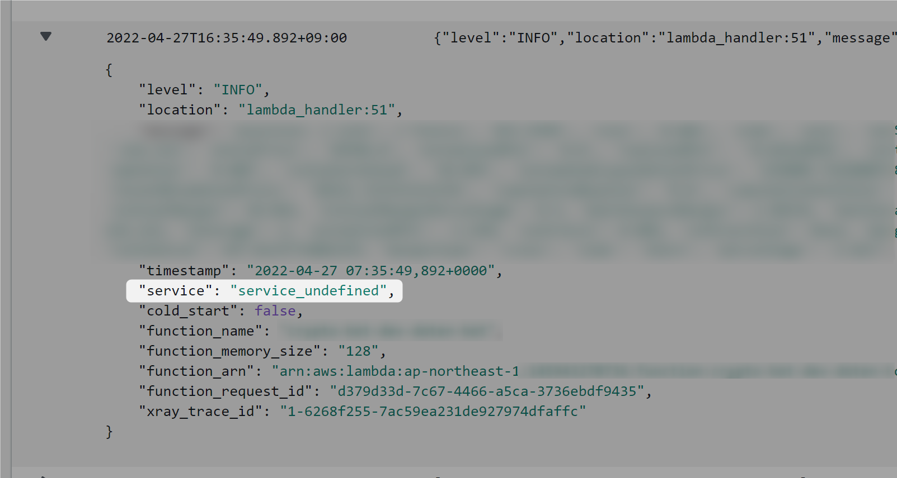

Lambda + Python の開発時には必ず使いたい [AWS Lambda Powertools for Python](https://awslabs.github.io/aws-lambda-powertools-python/latest/) のロガーについて調べたまとめ。

リポジトリはこちら。

[https://github.com/awslabs/aws-lambda-powertools-python]

この記事ではロガーについてしか扱いませんが、その他にも超便利な機能がたくさんあるのでぜひ使ってみてください。おすすめは [Typing](https://awslabs.github.io/aws-lambda-powertools-python/latest/utilities/typing/)、[Validation](https://awslabs.github.io/aws-lambda-powertools-python/latest/utilities/validation/)、[Batch Processing](https://awslabs.github.io/aws-lambda-powertools-python/latest/utilities/batch/) あたりです。

## ロガーの定義

```python
from aws_lambda_powertools.logging import Logger
from aws_lambda_powertools.utilities.typing import LambdaContext

logger = Logger()

@logger.inject_lambda_context
def lambda_handler(event: Event, context: LambdaContext) -> Response:
    logger.info(event)

    # do something...

    return
```

基本形。

ついでにインポートしている `from aws_lambda_powertools.utilities.typing import LambdaContext` というやつは前述した Typing のひとつで、Lambda の handler に入ってくる第二引数の型付けを行えるものです。context を使うことは正直あまりないけどいつもちゃんと書いています。

`@logger.inject_lambda_context` のデコレータは、handler に入ってきたイベントを自動的にキャプチャして出力してくれるものです（なのでこの場合は関数 1 行目にあるログ出力は実際にはいらない）。デコレータの引数に色々便利機能があるのでこれもとりあえずいつも書いておくレベルでいいと思います。

あとは

```python
logger.info(xxx)
```

の種類についてです。

## ログレベルと対応メソッド

Powertools のリファレンスはかなり充実しているほうですが、ログレベルと対応するメソッドの関係などはパッと見た感じなさそうでした。なので実際に書いて試してみた結果が以下。

```python
logger.debug()
# 下記のログレベルの設定で出力される
# DEBUG

logger.info()
# 下記のログレベルの設定で出力される
# DEBUG
# INFO

logger.warning()
# 下記のログレベルの設定で出力される
# DEBUG
# INFO
# WARN

logger.error()
# 下記のログレベルの設定で出力される
# DEBUG
# INFO
# WARN
# ERROR

logger.exception()
# 下記のログレベルの設定で出力される
# DEBUG
# INFO
# WARN
# ERROR

logger.critical()
# 下記のログレベルの設定で出力される
# DEBUG
# INFO
# WARN
# ERROR
# CRITICAL

```

自分はエラー系のログには `logger.error()` ではなく ` logger.exception()` を使っています。ログレベルはちゃんと ERROR で出つつ、スタックトレースなども含めて CloudWatch 上から確認できるため。

ちなみにログレベルは Lambda の環境変数に入れるだけで自動的に適用することができるので（コードとして何も書かなくていい）、CloudFormation や SAM のテンプレート上でグローバルに渡せる parameter を持っておくといいです。環境や運用ごとに一括で変更できます。

```yaml
MyFunction:
  Type: AWS::Serverless::Function
  Properties:
    FunctionName: my-function
    Handler: app.lambda_handler
    Runtime: python3.9
    Environment:
      Variables:
        LOG_LEVEL: INFO  # <-- これ
        POWERTOOLS_SERVICE_NAME: my-function
```

`POWERTOOLS_SERVICE_NAME` というほうは、CloudWatch で構造化ログが出力されるときに関数の名前などをあてがうことができる機能。


*指定しないと `service_undefined` になる。*

こんな感じ。
