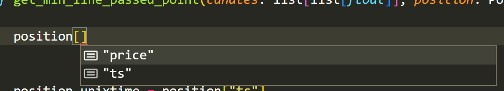

Python で辞書オブジェクトを扱うとき、ある辞書の「キーのセットとその型」をひとまとまりで定義しておきたくなることがよくあります。

```ts
interface User {
  name: string
  age: number
  address: string
}

type User = {
  name: string
  age: number
  address: string
}
```

「クラスを作るほどではないけど最低限の束縛やデータのまとまり表現がほしい」という観点で、ちょうど上記のように TypeScript における interface や type のようなものが Python で書けないかと色々試行錯誤してみたので紹介します。

Python に擬似的な静的型付けを導入済みであることは前提とします。

## TypedDict をつかう

標準モジュールに型に関する諸々を扱う `typing` というものがありますが、その中にある `TypedDict` を使います。

インポートはこうです：

```python
from typing import TypedDict
```

ビルトイン化したのは Python 3.8 からなので、それ以前のバージョンで使いたい場合には PyPl にある `typing-extensions` を使用します。

```shell
pip install typing-extensions
```

```python
from typing_extensions import TypedDict
```

インポートするときは単語の区切り文字が `-` ではなく `_` であることに注意してください。

PyPl の [このページ](https://pypi.org/project/typing-extensions/) を見ればわかりますが、Python は 3.6 近辺以降で型に関するアップデートが急増しています（作者が積極的に Python に型による堅牢性を導入しようとしているとのこと）。そのほとんどの機能が `typing-extensions` ではサポートされています。

:::info

後方互換性がどのバージョンまで保たれているかは明記がないのですが、それは「しばらくすると少しずつこれらの機能は廃止されていきます」という説明からも動的であることが理由のように思えます。

:::

### つかいかた

利用方法はとても簡単で、以下のようにするだけです。とても感覚的。

```python
class User(TypedDict):
  name: str
  age: int
  address: str
```

これはもちろん普段のプリミティブな型やクラスと同様の型アノテーションとして使用することができ、例えば引数の受け渡し時などに効果を発揮します。

```python
def logIn(user: User) -> None:
  ...
```

ちなみに、いわゆる「Optional 指定」も可能で、こういう書き方もできます：

```python
class User(TypedDict, total=False):
  name: str
  age: int
  address: str
```

ただしご想像の通り、特定のキーだけを Optional にする方法は（今のところ僕は）知りません。あったら教えてください。

その他、辞書オブジェクト名を入力したときその後に続くキー名の補完が効くのがかなり素敵です。こういう小さなイベントが開発のモチベーションを上げてくれますよね（たぶんそういう意味では「小さく」はない）。



## @dataclass について

Python 3.7 以上であるならば `dataclass` というものを使うことで上記と似た挙動を実現できますが、これは使用のたびにクラスを生成するような作業が必要になるため「単なる辞書を扱いたい」というニーズからはズレ始めます。

```python
@dataclass
class User:
  name: str
  age: int
  address: str

print(User("mirumi", 3, "Mofu"))
print(User(name="mirumi", age=3, address="Mofu"))
```

常用したことがないのでこれについては終わりにしますが、「似たようなものがある」という情報として残しておくことにします。

## タプルの場合

本記事のメインの趣旨とはこれも少し違うものですが、タプルでも同じようなことが可能です。

```python
from typing import NamedTuple

class User(NamedTuple):
  name: str
  age: int
  address: str
```
