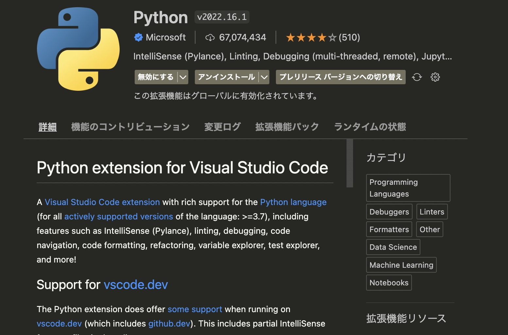
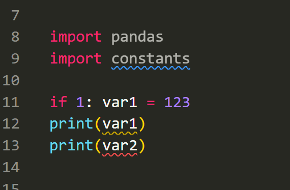

Python で型ヒントを書けることは随分広まってきましたが、それにエディタ(の拡張機能など)を関連づけることでほぼ静的型付け言語と同レベルの堅実な実装ができることはまだあまり知られていません。

この記事では、自分が Python を書く際に導入している静的型検査に関する設定、それに紐づく Linter、そしてコードの整形を行う Formatter までをまとめて紹介します。

Formatter 部分は JavaScript 周辺のエコシステム以上に混沌としており全体の理解や状況の把握も難しいため、この記事では俯瞰的な説明は行いません。一例として参考にしていただければ嬉しいです。もちろんですが、フォーマットのカスタマイズ部分もだいぶ個性が介入してはいます。

ちなみにいわゆる Linter に属するツールも Python にはたくさんのものが存在している状況ではありますが、こちらは静的型検査を導入しようとする過程で（現状は）ほぼ使うツールが一択に絞られてくるのであまり気にしなくていいと思います。今後も新しいバージョンの Python を積極的に使っていくつもりがあるならなおさらです。

エディタは VS Code を使っていることを前提としています。

## 静的型検査の導入（Pylance）

Python への型の導入には [Pylance](https://marketplace.visualstudio.com/items?itemName=ms-python.vscode-pylance) を使います。

実体は VS Code の拡張機能であるものの、このツールの歴史はだいぶややこしいです。とりあえず覚えておけばいいのは「今の Python で型のアルゴリズムと自動チェックを導入したいなら、これまで色々普及してきたものの色々な意思のうちのほとんどが Pylance に集約されている」という感じです。

だいぶ語弊がある紹介だとは思いつつも、普段から VS Code を使って開発をしているなら実質一択でいいと僕は考えています。このほかにも「mypy」などのワードを見かけることがあると思いますが、これは「型検査自体には使わずにいい、外部パッケージの型定義の導入の際などに少し関係することがある」くらいの理解をしておくといいと思います。

もう少し詳しく知りたい場合は適当に関連するワードを組み合わせてググってみるといいと思います（「Pylance mypy」や「Pylance Pyright」など）。

ちなみに、Pylance はこのあとさらに Python の標準言語機能（言語サーバー）に統合される予定で、ますます確実にデファクトスタンダードになっていくものと思われます。

### インストール

VS Code の通常通りの拡張機能インストールに従ってください。


*これ。*

ないとは思いますが、標準の「Python」拡張機能（Microsoft 製のやつ）が入っていない場合は有効化されなかったりインストールを促されたりすると思います。

### Linter としての設定

標準状態でも静的型検査の設定であるとともに Linter としても機能するようになりますが、もちろん追加の設定をしていくほうがよいでしょう。

今回は自分の設定を紹介するがてら機能の概要説明を絡める感じで進めます。詳しい各設定項目については[リファレンス](https://github.com/microsoft/pylance-release#settings-and-customization)を参照してください。Linter としての各項目のリファレンスは別で、[こちら](https://code.visualstudio.com/docs/python/settings-reference)です。

[https://github.com/microsoft/pylance-release#settings-and-customization]

[https://code.visualstudio.com/docs/python/settings-reference]

設定内容は以下。説明もコメントで入れています。

```json
{
    // ストリクトモード（厳しい検査）の有効化。
    // せっかく導入するわけだし脳死で ON をおすすめ。
    "python.analysis.typeCheckingMode": "strict",
    
    // 自作モジュールや型定義が含まれていない外部パッケージなどの型情報を
    // VS Code に伝えるための「.pyi ファイル」を格納するディレクトリ。
    // ここで指定したものはプロジェクト内で自動的に走査される。
    "python.analysis.stubPath": "./typings",
    
    // コーディング中にインテリジェンスされたモジュールのインポート文を自動挿入するか。
    // 僕はこの手の自動的なものがあまり好きではないのと、
    // 気づかぬうちにけっこう追加されていることが多かったので無効化しています。
    "python.analysis.autoImportCompletions": false,
    
    // いわゆる Linter としての細かいカスタマイズ部分です。
    "python.analysis.diagnosticSeverityOverrides": {
        // 未使用のインポート文の扱い。
        // デフォルトでもちゃんと薄暗いフォントに変わるので無効化でいいと判断。
        "reportUnusedImport": "none",
        
        // 未使用のクラス。同上。
        "reportUnusedClass": "none",
        
        // 未使用の関数。同上。
        "reportUnusedFunction": "none",
        
        // 条件分岐などでバウンドされていない可能性のある変数の扱い。
        // デフォルトでは警告止まりですが、これはエラー扱いに変更。
        "reportUnboundVariable": "error",
        
        // 外部モジュールの実体が見つけられないときの扱い。
        // ここを information にしていることについては後述します。
        "reportMissingModuleSource": "information",
        
        // 外部モジュールの型定義ファイルが見つけられないときの扱い。
        // ちなみに TypeStubs が型定義ファイルのことです（.pyi）。
        "reportMissingTypeStubs": "information",
        
        // 正規表現パターン内などで raw 文字列を使わずにスラッシュを直書き
        // しているときの扱い。デフォルトは警告されるが、個人的な趣味でレベル下げ。
        "reportInvalidStringEscapeSequence": "information",
        
        // total=False な TypedDict の変数にアクセスしようとしたときの扱い。
        // デフォルトは忘れましたが警告を出させるようにしました。
        // （パッケージによってはしんどいシーンがあるので調整をおすすめします）
        "reportTypedDictNotRequiredAccess":"warning",
    },
}
```

Python における型アノテーションのいろは的なことはこの次の項で軽くまとめていますのでそちらで。

Linter の各カスタマイズ項目のほうですが、これはそれぞれの値として

- none
- information
- warning
- error

の 4 つの段階があり、これはそれぞれ

- 見た目の変化なし
- 青い波線
- 黄色い波線（ファイルツリーやタブ名にも反映）
- 赤い波線（ファイルツリーやタブ名にも反映）

という差で情報の提示方法を区分してくれます。いわゆる「Severity (重大度)」というやつですね。


*実際のスクリーンショット。 8~9 行目は未使用インポートなので薄字、9 行目は青い波線（information）、12 行目は黄色い波線（warining）、13 行目は赤い波線（error）です。*

毎度コマンドを実行したり VS Code の formatOnSave などの設定をしたりする必要もなく、拡張機能をインストールして設定を書き込むだけでこのように静的型付け言語のような体験が得られます。

ただし言うまでもないですが、別にこのあとにコンパイルがあるわけでもないのでエラーが出ていようがコードのプッシュやデプロイを止める力までもが手に入るわけではありません。

とは言ってもエディタが赤くなっているのに無神経にコミットをする人はそういないでしょうし、GitHub 上でワークフローを組んでプルリクを食い止めたりすることはできそうです。

チームメイトのスキルや人間にあわせて重大度をカスタマイズしていくといいでしょう（黄色くらいなら全く気にしない人は山ほどいるので…）。

### Python で型を導入するのことはじめ

本記事で取り扱うメインの話題からはやや逸れるので簡単にですが、「Python に型を導入するときとりあえずどうすればいいの」部分だけまとめてみます。しばらくしたら情報量を増やすとともに別記事に切り出す予定です。

#### タイプヒントの基本的な書き方

```python
def sum(x: int, y: int) -> int:
    return x + y

var1: int = 123
var2: int = 456

print(sum(var1, var2))
```
#### Python 3.7 くらい以上でイマドキのタイプヒントを書くときに必要なもの

例えば型の OR をやりたいとき、Python 3.10 からは下記のように書けます。

```python
var3: int | str = "123"
```

いいですね。メジャーな他言語とも同じシンタックスで混乱が少なそうです。

じゃあ Python 3.9 まではどうすんのという話になるんですが、そのためには下記のようにします。

```python
from __future__ import annotations
```

`__future__` には互換性のための便利モジュールが色々入っているんですが、タイプヒントの書き方もそのひとつとしてここでインポートできます。Python 3.7 から利用が可能です。このインポート文はファイルの先頭に書かないと実行時エラーになるのでそこは忘れずに。

Python 3.6 以下の場合は Union 型として書くしかありません。

```python
var4: Union[int, str] = "123"
```

でも Python 3.6 はもうサポート期限切れ（2021年12月まで）なのであまり気にする必要はないとは思います。

それと、型を使って Python を書いていく上で（多くのケースで）他に必要になるものがあるのでこれも一緒にインポートしておきます。

```python
from typing import Any, cast, Literal
```

僕はいつもこの 3 つあたりはファイル先頭に `from __future__ import annotations` と一緒に書いちゃいます。いくつかはこの次で紹介します。

#### ジェネリクス（複合型）

さっき `Union` でちらっと登場しましたが、いわゆるジェネリクス的なやつです。

```python
from __future__ import annotations

var5: list[int] = [1, 2, 3]
var6: dict[str, Any] = {"aaa": 4, "bbb": "5", "ccc": var5}
```

おそらく Python の型づけで最も理解するのが難しいのがここで、理由は

- コレクションの種類と構造の把握が難しい
- `list` と `List` など同じもので大文字小文字違いのものがたくさんある

の 2 つが挙げられます。

1 つめに関しては[ここ](https://future-architect.github.io/articles/20201223/#コレクションの種類の使い分け)でわかりやすい解説と使い方が紹介されているのでとりあえずざっと雰囲気を掴んでおけばいいと思います。

そして 2 つめですが、今日 Python の型について新しく知る方は<strong>大文字から始まるジェネリクス型は基本的に存在しないものと思っていい</strong>です。

これまでジェネリクス型をアノテーションするには `typing` パッケージからそれぞれのクラスをインポートして書かないといけなかったのですが、 `from __future__ import annotations` をインポートできるならビルトイン型として小文字表記のアノテーションができるようになります。

さっきの例でもインポートを書いていたのはそれが理由です。

```python
from __future__ import annotations  # <- これ

var5: list[int] = [1, 2, 3]
var6: dict[str, Any] = {"aaa": 4, "bbb": "5", "ccc": var5}
```

お察しの通り、これは Python 3.10 以降なら追加のインポートなしで標準的に書けるシンタックスになります。

ちなみに「基本的には」と書いたのは、コレクション系は `from collections.abc import Xxxxx` などのようにインポートして使う関係上、インポートする実体は大文字始まりになるからです。

しかし上で紹介した記事にもあるように（かつ自分も同じ意見）、最初は `list`、`tuple`、`dict` などから使えば十分だと思います。これだけで Python を書きたくない現象からはほぼ解き放たれるはず。

#### 困ったときのキャスト

どうしても型のコントロールがうまくいかないときはあるので、そういうときはキャストします。

```python
var7 = unknown_function()

sum(var1, cast(int, var7))
```

キャスト自体があまり積極的に使うべきでないものというのは置いておくにしても、このキャストだけは見た目が本当に煩雑になるのでかなりイケてないですよね。僕もここだけは気に入っていなくて、なるべく別の方法がないか考えたりします（自分が使うところだけでも手動で型定義ファイルを書く、など）。

#### 外部パッケージの型定義をどうにかする（インポートできるが type stub がないと怒られる）

もともとが動的型付け言語である以上、その辺にあるすべてのパッケージが美しい型定義を提供してくれているわけではありません。でも体感的にはメジャーなものはだいたい揃っているとは思います（この次に書く外部の型定義ファイル導入を含む）。

これを解決するには大きくわけて 3 つの方法があります。

1. 型定義を提供してくれるさらに外部のサポートを探す
2. 自分でどうにか頑張る（キャスト、Any 攻め、クラス探し）
3. 自分で型定義を書く

ここまでにもちらほら登場していますが、型定義と言っているのは .pyi ファイルのことで、TypeScript がわかる方はあれの .d.ts ファイルと同じもの、と思えばいいと思います。

これがあれば VS Code の言語サーバー機能を経由して拡張機能などの恩恵を与れるようになる、というわけです。

最も優先すべき方法は 1 つめの「型定義を提供してくれるさらに外部のサポートを探す」で、要はそういうパッケージを探してきてインストールするだけです。ほとんどの場合でインポート文を書く必要はない（エディタが認識している Python の環境で該当モジュールがインストールされていれば反応する）ので、コード側の変更もありません。

探すときは、「パッケージ名 type stub」などでググるとよく見つかります。「mypy」が有名どころの型定義パッケージを提供してくれたりしているのでお世話になることも多いはず。専用で開発されている OSS などもよく見かけます。

2 つめの「自分でどうにか頑張る」は、前述の `cast` やいわゆる「なんでも OK」の `Any` を使う、あとは別アプローチとして「型定義ファイルがなくとも大抵のライブラリにはインポートできるクラスがあるはずなのでそれを探して実装に入れていく」などの方法です。プロジェクトの真面目さで何を選ぶか決めます。

最後ですが、自分で .pyi ファイルを書く方法です。

```python
from __future__ import annotations
from typing import TypedDict

class NiceClass(TypedDict):
    abcd: int
    defg: str
    hijk: dict[str, str | None]

def function1(x: int, y: int) -> float:
    ...

def function2(val: object = ...) -> None:
    ...
```

普段のコードのうち型定義に関係していそうなところだけとりあえず書けばいい、と覚えておけば OK（雑）。実装やデフォルト引数など個別のものを書きそうな場所には `...` を置きます（これもちゃんと Pylance が教えてくれます）。

書いたら `"python.analysis.stubPath"` で指定したディレクトリにこのファイルを置くだけです。

これは、<strong>Lambda Layers のようにエディタ側に伝えようのないコード構造に対応させることができる</strong>ので重宝します。

#### Pylance を入れるとシンタックスハイライト的にエディターが見づらくなる

これは実際のところかなり由々しき問題なので間違いなくここで取り上げておきたいです。

Pylance を有効化すると、シンタックスハイライトするのに使われるトークンが書き換わるのですが、それのおかげでエディタ上のほとんどの要素が緑文字で下線だらけになってしまいます（文字の色は僕のテーマ(Monokai)によるかもしれませんが、下線はたぶんみんな引かれます）。

もうこれが冗談じゃないほど見にくいので絶対になんとかしたくなると思うのですが、もしそうなったら下記をお試しください。もとに戻ります 🎉

```json
{    
    "[python]": {
        "editor.semanticHighlighting.enabled": false,
    },
}
```

## Formatter の導入（yapf -> Black）

:::rewrite 2023/1/6
色々あって yapf から [Black](https://github.com/psf/black) に変えました。

簡単に言うと、初めからこちらにしておけばよかった。不満はゼロに近く、たぶん個人でもチームでもこれからずっと使うかなという意見。いまの Python 界隈でも一番人気がある雰囲気ですね。

普段の開発時にはコマンド（モジュール）としては使わず、VS Code の拡張機能として利用しています。これだとワークスペースの推奨事項に含められるのでチームメンバーにも使ってもらいやすいです。CI の中ではもちろんコマンド実行も OK。

以下の記述は yapf 時代のものとして一応残しておきます。そのうち Black 単体の紹介もどこかに書くかも（でもできることがほぼない(それが Black のよいところ)ので紹介することがあんまりないのよな…）。
:::

次は Formatter です。こちらはコードの見栄えを整えるものです。

例によって多種多様なツール（と整形ルール）が溢れかえっていますが、今回は「yapf」というものを使います。最近人気です。

[https://github.com/google/yapf]

インストールは pip を使います。

```shell
pip install yapf
```

僕は PEP8 で制定されているルールでどうしても納得できないものが多く（特に 1 行 79 文字の縛り。現代の開発環境やリポジトリの閲覧状況などからしても不要な改行が増えすぎると思う）、独自にカスタマイズしたい人にとってはおすすめのツールです。

yapf は VS Code 用の拡張機能などで存在しているものではないので、どうしてもインストールを各メンバーに自主的にやってもらうしか方法がない（リポジトリを開いたときに VS Code にインストールを促してもらうことなどができない）。

### yapf のカスタマイズ

これも settings.json に書くことで設定を行います。  
リファレンスは[こちら](https://github.com/google/yapf#knobs)。

```json
{    
    // 使用するフォーマッターの指定。
    "python.formatting.provider": "yapf",

    // yapf の整形ルールの指定。
    // 困ったことにインラインの文字列としてしか制御できないため見づらいし編集もしづらい。
    "python.formatting.yapfArgs": [
        "--style={allow_multiline_dictionary_keys: false, allow_split_before_default_or_named_assigns: true, allow_split_before_dict_value: false, arithmetic_precedence_indication: true, based_on_style: google, blank_line_before_nested_class_or_def: false, blank_line_before_module_docstring: false, blank_line_before_class_docstring: false, coalesce_brackets: true, column_limit: 160, dedent_closing_brackets: true, each_dict_entry_on_separate_line: true, force_multiline_dict: true, indent_dictionary_value: true, spaces_around_default_or_named_assign: false, spaces_before_comment: 2, space_between_ending_comma_and_closing_bracket: true, split_arguments_when_comma_terminated: true, split_all_comma_separated_values: false, split_before_bitwise_operator: true, split_before_dict_set_generator: true, split_before_logical_operator: true}"
    ],

    "[python]": {
        // 保存するたびに自動で整形するようにする。
        "editor.formatOnSave": true,
    },
}
```

各カスタマイズ項目の理解は正直諦めてます。リファレンスはあまり細かく教えてくれない上に、ひとつずつ試してもどこがどう変わっているか把握が難しい＆複合設定で変わるものなどは組み合わせの数が多すぎて実験できないからです。

とはいえ、自分はこのルールでわりと長くコードを書いているので（少なくとも僕は）問題ない状態にはなっています。だいぶ好みがあると思うのでここはリファレンスとにらめっこしながらみなさんもひとつずつやってみてください。

ちなみにベースのルールを設定できるので（ここに PEP8 もある）、いくつかのメジャーなルールをデフォルトのまま使うのは簡単です。僕は Google のやつを使ってます。

## セッティングした内容をリポジトリに含める

最後は、ここまで設定した内容をチーム（プロジェクト）に強制するためにリポジトリに含めます。

VS Code はプロジェクトルートに「.vscode」というディレクトリがある場合、その中にある各種設定ファイルを優先して反映させるのでこれを利用します。

```shell
.vscode/
├── extensions.json
└── settings.json
```

こう。

extensions.json は、このリポジトリを開いたときにここに書いてある拡張機能のインストールを自動で促してくれるもの。

今回だとこうなると思われます。

```json
{
    "recommendations": [
        "ms-python.python",
        "ms-python.vscode-pylance",
    ]
}
```

前述の「yapf はこういう対応ができない」はここに追記できないという意味でした。

settings.json については該当する項目だけいつも通り書けば問題ないです。ここまでカスタマイズした内容をまとめておきましょう。

これですべての準備が整いました！  
お疲れさまでした。
