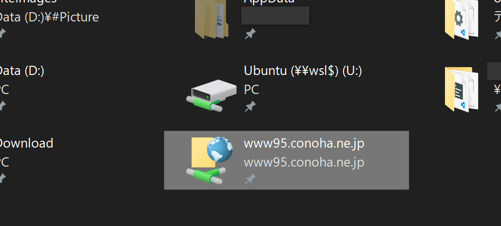
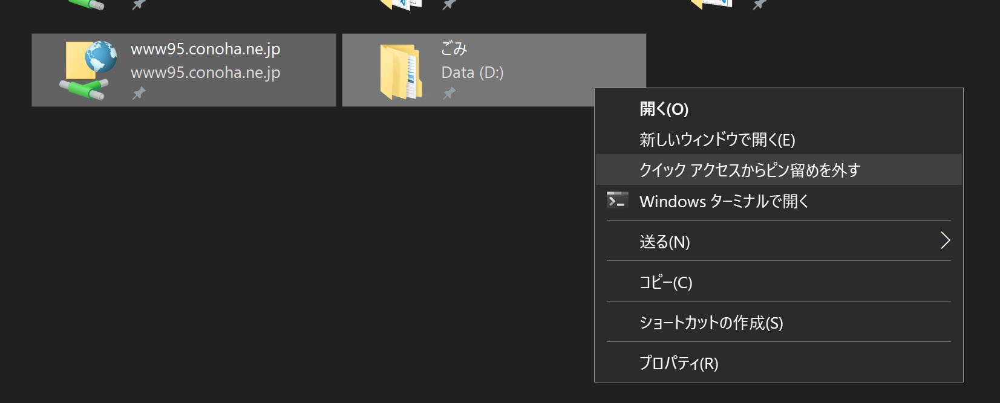

Windows 10 のクイックアクセスに一度でも FTP サーバーを追加してしまうと簡単には削除できないという不具合があります。

右クリックしても無反応、再起動しようが Windows を更新しようが消える気配がありません。

## 解決方法

ひょんなことで見つけた解決方法ですが、なんと**他の項目とあわせて複数選択して右クリックメニューを開く**ことで [クイックアクセスからピン留めを外す] が現れます。なんだそれ。

*もちろんクリックしたら両方ともちゃんと消えます。*

## クイックアクセス自体をリセットする

この記事に辿り着いているみなさんなら既に読まれた内容だと思いますが、クイックアクセス全体をリセットする方法自体は有効です。

### 自動追加された内容の初期化

下記ディレクトリ内のファイルを一掃します。

<pre class="language-no">C:/Users/[UserName]/AppData/Roaming/Microsoft/Windows/Recent/AutomaticDestinations</pre>

<pre class="language-no">C:/Users/[UserName]/AppData/Roaming/Microsoft/Windows/Recent/CustomDestinations</pre>

用事がなくてもついでにキャッシュ削除しておくと少し気持ちよいですね。

### レジストリからの初期化

キーは下記。

<pre class="language-no">HKEY_CURRENT_USER/Software/Microsoft/Windows/CurrentVersion/Explorer/Ribbon</pre>

この中にある `QatItems` という項目を削除すればOKです。

上記ディレクトリ内のファイル削除との関連性が詳しくわかっていませんが、作業順序として「ファイル削除してダメだったらレジストリ初期化」が望ましいでしょう。言うまでもなくレジストリを触るときは慎重に。
