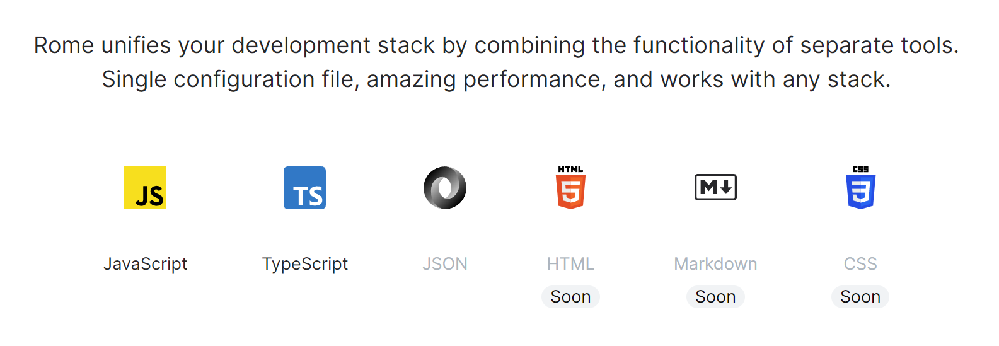

JS 周辺のエコシステムで生活している人、特にフロントエンドをよく書く人は関連ツールの多さ、その選択、組み合わせのパターンでハマったり…と、その他あらゆる問題で困っていると思います。自分もプログラミングの便利ツール系に関してのみ言えば「選択肢が多いことより使うものは決められているほうが好き」のタイプなので、昔からここだけがずっと苦しみポイントでした。

この問題を解決するためには長年の JS 周辺ツールの開発成果を全部取りまとめないといけないことになり、たとえば ESLint や Prettier は本体だけだとしてもとても大規模で複雑なプログラムなわけで、「全てを統合していい感じにする」など夢のようなことと考えられていました。

これに対して真っ向から勝負を挑んだのが [Rome](https://rome.tools) というツールです。ほぼゼロからリンターやフォーマッターの機能を書き直しているそうで、パフォーマンスが特に売りにされています。それもそのはずで、自分が気に入った理由でもありますが、Rust 製なんですよね。実際に node_modules/ ディレクトリの中のパッケージ本体を見てみればわかりますが、中にあるのは JS ファイルではなくバイナリだけです。

名前だけは数年前からそこそこ知れていたように思うし、実際過去に自分も試したことがあるのですが、そのときは自分の好みやスタイルに合わないなというふうに漠然と感じてすぐ使用をやめてしまいました。

今回、サーバーや CLI ツールなどを TS で書くようになったタイミングで「フロントエンドのややこしい部分を除外できるなら利用価値は大いにあるはず」ということで導入してみたらもうただ完璧だったという話です。

ちなみに昔よりコンフィグの自由度は上がっているので、最近試していない方は再試行の価値ありです。

## できること

いまのところリンターとフォーマッターの機能のみにフォーカスしていて、対応ファイル種別の増加が目下の目標に見えます。



HTML は純粋に嬉しいけど、CSS は細かいローカルルール多すぎてさすがに個別の調整欲しくなりそうだけどどうなるかなあ…。

そのほか「インポート文の順序整理」もサポートされています。他の言語やツールを見てもわかりますが、インポート文の整理はリンターでもフォーマッターでもないカテゴライズになっていることが多く、Rome でも似たような立ち位置になっています。記事執筆現在ではややエクスペリメンタルな雰囲気ですが、僕はこの機能が他の言語でも大好きなのでもちろん使っています。  
（実は今回 Rome に戻ってきたのも、インポート順を整理したいためにまた大量の外部ツールと格闘しなければいけなくなったことに心底辟易としたからです）

基本は npm パッケージとしてインストールされることが推奨されますが、VS Code と統合された公式の拡張機能が既に存在しているので、「上書き保存したらリントもフォーマットもすぐ実行」などはもちろん簡単に設定できます。速くてびっくりします。


*拡張を使う場合でもプロジェクトのパッケージとして rome 自体もインストールすることが推奨されています（類似ツールはだいたいそうですが）。*

## つかいかた

VS Code の拡張を使う前提で書きます。

拡張のインストールと npm パッケージとしての rome のインストールを終えたら、プロジェクトのルートに rome.json を作成します。

:::info
rome のインストールは devDependencies で問題ありません：

```sh
npm i rome --save-dev
```
:::

rome.json はなにも書かなければすべてデフォルトの状態のまま使用するとみなされ、特に何も起きません。ファイルが存在しない場合も同様です。VS Code で使う場合は VS Code 側の設定としてコンフィグを書くことも可能ですが、これはリポジトリに含めるほうがいいでしょう。従来のツールもほぼすべて同様の運用だったと思いますし（ただしファイルは rome.json たったひとつでいいのです！！）。

自分の rome.json はこんな感じです。

```json
{
    "formatter": {
        "indentStyle": "space",
        "lineWidth": 120
    },
    "organizeImports": {
        "enabled": true
    },
    "javascript": {
        "formatter": {
            "semicolons": "asNeeded"            
        }
    }
}
```

ほぼ何も変えていないです。`lineWidth` だけ多くの人より大きい値になっていますが、基本的には僕も短くしたいと思いつつ、関数のシグネチャ行がすぐ複数行になってしまうのがどうしても嫌でここの数字を下げられずにいます（関数定義の行をパッと見た瞬間にそれがどういうものなのか瞬時に理解するためには一行のほうがわかりやすいと思っている）。

あとは個人プロジェクトならたまに `noNonNullAssertion` をオンにしたりするくらい。

自動保存による実行の設定はいつもみたいな感じなので特に難しいことはないです。

```json
{
    "[javascript]": {
        "editor.tabSize": 2,
        "editor.defaultFormatter": "rome.rome",
        "editor.formatOnSave": true,
    },
    "[typescript]": {
        "editor.tabSize": 2,
        "editor.defaultFormatter": "rome.rome",
        "editor.formatOnSave": true,
    },
}
```

package.json にも手動実行のコマンドを加えておきましょう。CI などで利用できます。

```json
{
    "scripts": {
        "rome-format": "rome format",
        "rome-lint": "rome check",
        "rome-ci": "rome ci"
    }
}
```

rome ci というコマンドは、リントもフォーマットも実行し、もし何か問題があれば exit code を `1` で処理を終えるというものです。コミットを積んで強制的にフォーマットさせたいようなときは上記でいうところの `npm run rome-format` をやって、メインブランチ前へのマージでは `npm run rome-ci` が動く、などがいいかもしれません。

これであとはもう何も気にする必要はなく、快適に開発が行なえます！  
Rome、流行らせていきましょう～
