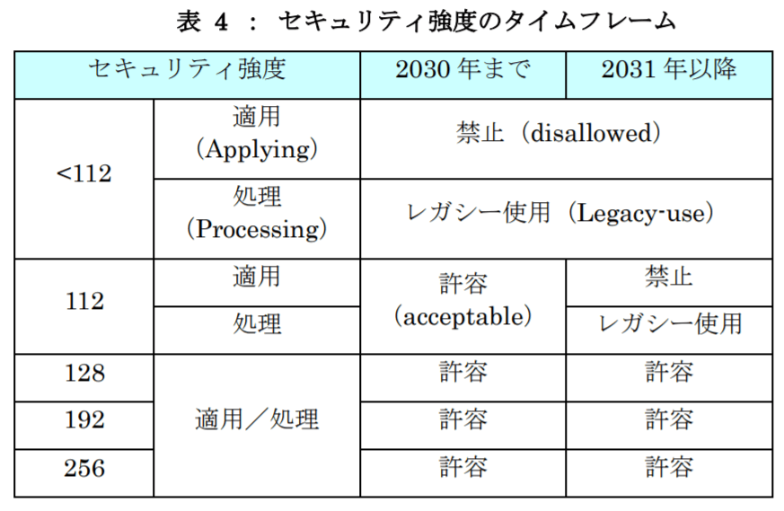
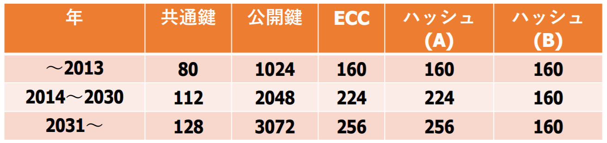
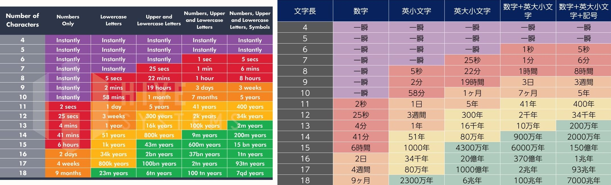
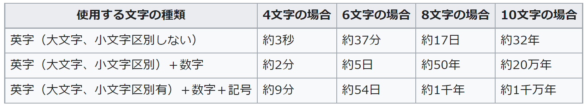
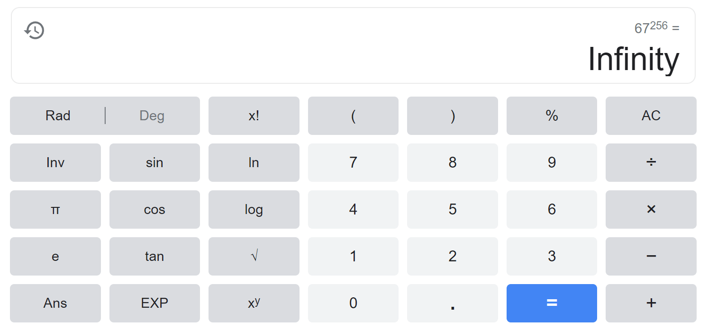
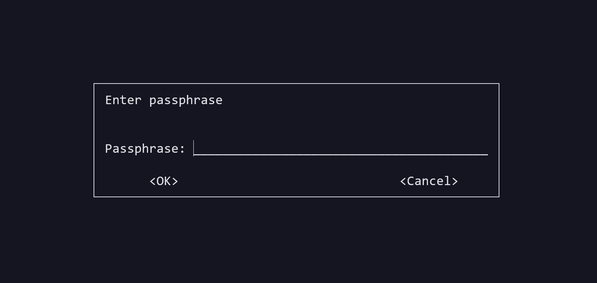
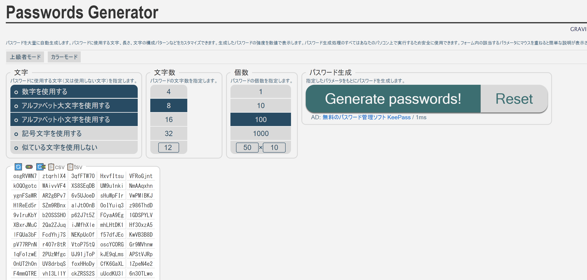
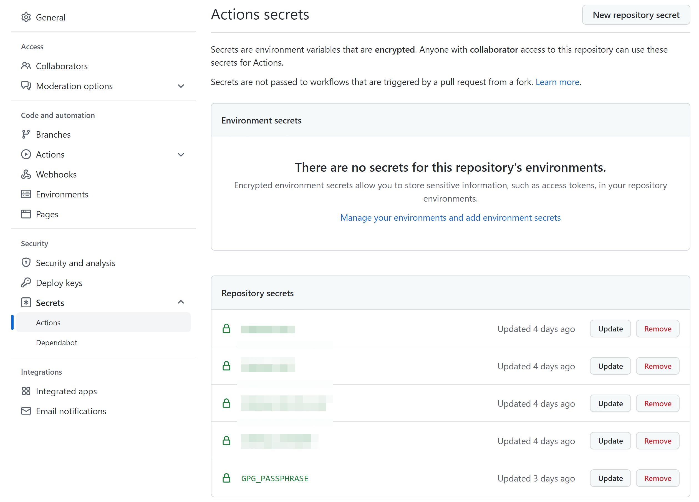

つくったアプリケーションのソースコードは公開したい、でもシークレットはどうにかして秘匿しないといけない。継続的な運用を目指すならシークレットのデータ自体もなんとかしてリポジトリに（Repository secrets などではなくコミット対象として）含める必要がある。

…という状況を解決するために、[gpg](https://gnupg.org) だけを使って継続的な運用を図る手段をまとめてみます。フロントエンド/バックエンドなど問わずどこでも使用できます。

<div class="box-common box-alert">
<p>Web フロントエンドなどから各種 API キーを利用する場合、リクエスト時の挙動はデベロッパーツールで全て確認できてしまう点には留意してください。</p>

<p>これらは API サーバー側でオリジンの制限をかけるなどの検討が必要です。</p>
</div>

## やること

主な作業内容の要約は

- gpg を使ってプッシュする前にローカル側で暗号化をする
- 暗号化するときに復号化のための(**最強の**)パスフレーズを登録する
- そのパスフレーズを GitHub の Repository secrets に登録しておく（忘れてもいい）
- GitHub Actions を使った CI/CD の中で Repository secrets を参照して復号化させる

となります。

アプリケーションのソースコードとしてシークレットを使いつつ、それらもちゃんとリポジトリにコミットさせながら運用できる方法です。

また、ファイル単位での暗号化/復号化なのでプロジェクトや開発環境を選ばないこと、パスフレーズを含めた鍵の管理をしなくても(事実上)問題ないことなどもメリットになると思います。

## 安全性

実際の作業に移るまえに、たぶん気になっているであろう安全性についての話をしておきます。

「単なるパスワードでの開け閉め」と言われると不安になるのではないでしょうか。しかもシェル上でチャレンジができるゆえに自動化も容易そう、なんなら解読の手段自体（＝ gpg の特定のコマンドを使ってあとはパスフレーズを入れるだけ、という状態）も既にバレています。

攻撃者の立場からするとアプローチは大きく２つあり、

1. 対称鍵暗号方式のアルゴリズムに則って解読を進める
2. パスフレーズの総当りを仕掛けていく

となります<span style="font-size: 0.8em;">（対称鍵暗号方式の解読も総当たり攻撃といえますが便宜上分けています）</span>。

これらについて考察をしてみます。

### 対称鍵暗号方式

対称鍵暗号方式（＝共通鍵暗号方式）に対しては、最新バージョンの gpg で使えるものを選択している時点で安全であると言って差し支えないでしょう。

これを書くと元も子もないのですがそれはそのはずで、オープンソースであり世界中の諜報機関さえも使っているアルゴリズムであるならば、現状でこれらの防御力を僕ら一般人が気にするのは理にかなっていません。それよりもっと気にするべきことがきっと山ほどあるでしょう。

開発者目線だと普段目にするものが公開鍵暗号ばかりなせいで共通鍵暗号がレガシーなものに思われているフシがあるようなのですがそんなことは全くなく、むしろ基本的には暗号強度で言えば共通鍵暗号のほうが上とされています<span style="font-size: 0.8em;">（「総合的な安全性」ではなく「暗号強度」の話であることに留意してください）</span>。  
この話は RSA のビット数が 2048 だの 3076 だのあるのに対して AES などが 128 や 256 であることから容易に理解できます。

速度と鍵管理の面で課題視された結果ソフトウェア開発の場などでは公開鍵暗号がよく使用されるようになりましたが（SSH、サーバ証明書etc...）、例えば Wi-Fi のセキュリティキーである WPA2 には今も AES が使われています。

そしてさらに、感覚的に AES-128 の強度について理解できるよい例えがあったので紹介しておきます：

> ・地球上のすべての人が 10 台のコンピューターを所有しています。  
> ・地球上には 70 億人の人々がいます。  
> ・これらの各コンピューターは、1 秒あたり 10 億のキーの組み合わせをテストできます。  
> ・平均して、可能性の 50% をテストした後、キーをクラックすることができます。
> 
> そうすれば、77,000,000,000,000,000,000,000,000 年で 1 つの暗号化キーを解読できます！
> 
> 出典：[https://www.eetimes.com/how-secure-is-aes-against-brute-force-attacks/](https://www.eetimes.com/how-secure-is-aes-against-brute-force-attacks/)

もう何が何だかよくわからないですね（ちなみにこのあとにはもっとすごい例が出てきます!）。

NIST（米国立標準技術研究所）が推奨する鍵長のデータにならうと、2031年の時点でも 128bit が推奨範囲です。仮に今後 10 年以内に想定よりも遥かに大きな技術進歩があったとしても、さらにその上の鍵長である AES-256 を使っておけば問題はなさそうというのは感覚的にもわかるでしょう（実際は「鍵長が 2 倍 になったら 128bit 分増える→パターン数は 2<sup>128</sup> 倍分さらに増える」ので強度は感覚よりも遥かに上がる）。

 
*これはセキュリティのデファクトスタンダードが定義されている NIST の「Special Publication 800-57」を IPA が日本語向けにわかりやすくまとめ直したもの。左の列は対称鍵暗号方式のビット数を表しています。（出典：[https://www.ipa.go.jp/files/000055490.pdf](https://www.ipa.go.jp/files/000055490.pdf)）*

 
*こちらは同じデータソースに他の暗号化方式も加えたもの。今回の話は「共通鍵」の列を見ます。（出典：[https://www.kansai.meti.go.jp/2-7it/k-cybersecurity-network/relayseminar_2019/text03.pdf](https://www.kansai.meti.go.jp/2-7it/k-cybersecurity-network/relayseminar_2019/text03.pdf)）*

そしてダメ押しですが、開発者が好きこのんで公開しない限り暗号化アルゴリズム自体もわからない(と思う)のでこれもいくらかは防御力の足しになります（gpg がサポートする現代でも比較的安全性が担保されている対称鍵暗号方式だけで AES、TWOFISH、CAMELLIA、BLOWFISH 、3DES、CAST5、IDEAなどかなりの種類があります）。

これは `gpg --version` で確認できます：

```shell
gpg (GnuPG) 2.2.19
libgcrypt 1.8.5
Copyright (C) 2019 Free Software Foundation, Inc.
License GPLv3+: GNU GPL version 3 or later <https://gnu.org/licenses/gpl.html>
This is free software: you are free to change and redistribute it.
There is NO WARRANTY, to the extent permitted by law.

Home: /home/user/.gnupg
Supported algorithms:
Pubkey: RSA, ELG, DSA, ECDH, ECDSA, EDDSA
Cipher: IDEA, 3DES, CAST5, BLOWFISH, AES, AES192, AES256, TWOFISH,
        CAMELLIA128, CAMELLIA192, CAMELLIA256
Hash: SHA1, RIPEMD160, SHA256, SHA384, SHA512, SHA224
Compression: Uncompressed, ZIP, ZLIB, BZIP2
```

もちろんハナから総当りをするのであれば関係ありませんが。

### パスフレーズ

次にパスフレーズの総当りですが、これは説得力に富んだまともな文献を引用するのが難しいです。

というのも、ブルートフォースアタックは安全性を証明するのが「解読所要時間」くらいしかないと思うのですが、この所要時間というのがあまりにも定義がなさすぎて議論しづらいのですよね。

例えば

- 検証タイミングが１年違えば状況もかなり変わる、マシンスペックの進化速度的に情報の納得度合いが低い
- 使用文字種類、計算量（≒スペック）など抽象的な表現が多く根拠として提示するには弱い
- そもそも攻撃試行の仕組みが定義されていない時点で話は大きく変わる（計算量だけの論理時間なのか、試行の自動化にはどんなシステムを用いているのか、各試行ごとの間隔はどれだけの時間があいているのか、正解判定はどうなっているのか、etc…）

などがあります。

いくつか実例を紹介します。


*出典：[https://www.reddit.com/r/Infographics/comments/iovbi8/updated_table_on_time_to_brute_force_passwords](https://www.reddit.com/r/Infographics/comments/iovbi8/updated_table_on_time_to_brute_force_passwords)　と　[https://twitter.com/sen_u/status/1427538088113283072](https://twitter.com/sen_u/status/1427538088113283072)*

これは直近で話題になったもの。パスワードの総当り攻撃のことを言っているかと思われてかなりの騒動になったのですが、実際は md5 でハッシュされた値が漏えいしたあとにパスワードに復元されるまでの解読時間を記載したものでした（[参考](https://qiita.com/ockeghem/items/5a5e73528eb0ee055428)）。

その前提も書かれていなければ解読に使ったマシンのスペックさえも不明という状況です（これは後に調査されており、[Gigabyte GeForce RTX 2080 Ti Turbo11GB](https://amzn.to/32JGd2k) であることがわかっています）。

あとは IPA(情報処理推進機構) が公開しているデータもあるのですが、これは2008年と異常に古い。


*出典：[https://www.ipa.go.jp/security/txt/2008/10outline.html](https://www.ipa.go.jp/security/txt/2008/10outline.html)*

使用したマシンは Intel Core 2 Duo T7200 2.00GHz RAM/3GB とのことで、こんなのその辺に落ちてるスマホより劣る可能性すらあります。その証拠に、2009年にスーパーコンピューターと呼ばれていたものは、2016年時点で市販されているグラフィックカードの 10 分の 1 の速度しかないそうです。

というわけで、パスワードの総当たり攻撃に対して「問題がないこと」を証明するのは難しいです。

しかし**こんな測定例など足元にも及ばないほどの比類なき最強パワーを持つパスワードを用意できるなら話は別**と僕は考えます。

`2^256` という数字の大きさについて次のように例えている方がいました：

> ・太陽の寿命が来るまで今から 50 億年のあいだ、  
> ・100 億人の人が、  
> ・毎ナノ秒 1 兆個の数値を消費していく活動があり、  
> ・その活動を、太陽系が属するこの銀河系の全ての星（～2,000 億くらい）でおこなうと、  
> ・消費される数字の個数は、50 億年 × 100 億人 × 100000000 ナノ秒 × 60 秒 × 60 分 × 24 時間 × 365 日 × 1 兆個 × 2000 億個(星) で 59 桁の数字になる  
> ・こんなに頑張って消費しても、50 億年後 (太陽が赤色巨星になって太陽系が崩壊する頃) に消費し終わっているのは、全体の 100 京分の 1 。
> 
> 出典：[http://darutk-oboegaki.blogspot.com/2014/04/2-256.html](http://darutk-oboegaki.blogspot.com/2014/04/2-256.html)

既に人智を超えています。

しかしこれはまだただの `2^256`で す。英小文字大文字数字記号を入れたらもうどうなってしまうのか見当もつかないでしょう？

記号を５種類程度としても `67^256` なので…



計算機がさじを投げましたｗ

さらに言えば **gpg のパスフレーズには上限文字数がないのでより高みを目指すことさえできます。**

僕らが生きている間にこれらが突破されることはとてもではないけど考えにくいですよね。

さすがにここまで大きなパターン数であることがわかっていれば、論理的な証明ができていなくとも個人開発のシークレット管理においては十分と言っていいのではないでしょうか。

しかしみなさんお気づきだと思いますが、対称鍵暗号方式で S2K（入力されたパスフレーズをハッシュして鍵を作る仕組み）によって生成される鍵長が最大でも 256 であることから、 `2^256` **分以上を目指す必要すらそもそもありません。**

具体的にいえば、 `2^256` で十分であると仮定すると 10 進数ではおよそ 78 桁の数字になる、つまり数字だけを使ったパスフレーズでも 78 桁分あれば対称鍵暗号方式とほぼ同じ強度が保証されることになる、となります。

<div class="box-common box-info">
<p>ちなみに UUID の考え方もこれらと同じです。「限りなく広い選択肢の中からピックアップするので将来的にもかぶることはないだろう」というもの。UUID は<strong>たったの</strong> <code>2^128</code> なのでさっきまでの話に比べれば随分しょぼく感じますね。</p>
</div>

もし万が一、天と地がひっくり返ってリポジトリのシークレットが漏えいしたとしても、API キーなどには制限があるでしょうし、異常検知に対する防御や補償の仕組みも大抵は多重に存在するし、自分の人生が全て破綻するほどのことにもならないでしょう。個人で公開するようなアプリケーションであるならばなおさらです。

ここまで含めて僕はこの運用で十分と考えています。

## 作業と実装例

では実際の運用例を紹介していきます。

### 準備

まず gpg をインストールしましょう。

macOS の場合は最初から入っているケースもあるようです。僕は確認してみたらありませんでした。

ない場合は brew で簡単に手に入ります：

```shell
brew install gpg
```

Windows の場合は公式サイトからインストーラーを入手できます。

[https://www.gnupg.org]

最後に WSL 。僕は普段の個人開発環境が WSL2 なのでそこでインストール作業をやったはずなのですが、なにをどうしたか記憶が怪しく…。たぶん `apt install gpg` でよい、のかな…。

インストールでなんやかんや困ったら [このページ](https://gnupg.org/download/) に各 OS のバイナリ版もあるので使ってみるのもいいと思います。

インストールしたら

```shell
gpg
```

とだけ入力してみましょう。ユーザーディレクトリ下に `/.gnupg` が作られます。

初めて秘密鍵を生成したい場合は `gpg --gen-key` として対話型の初期設定的な作業が必要なのですが、それは公開鍵と秘密鍵のペアを作成して運用するためのもの（つまり公開鍵暗号方式）なので今回はやらなくても問題ありません。

### プッシュ前

ここからいよいよ目標のリポジトリ内で作業をします。

まずはローカル側で暗号化をします：

```shell
(sudo) gpg -c file.txt
```

`-c` オプションは対称鍵暗号方式での暗号化を示します。 `--symmetric` でも同じです。c は cipher の c ですかね。

デフォルトで AES-256 アルゴリズムが使用されるはずです（コンソールの出力に表示されます、違うパターンがあったらごめんなさい）。指定を強制する場合は `--cipher-algo AES256` です。

このあと別画面が開かれ（pinentry という）、パスワード入力待ちとなります。



ここですかさず [Passwords Generator](https://www.graviness.com/app/pwg/) を開きましょう。



パスワード生成器は色々試したのですが、自由度、開発者との相性の良さの観点からこれが気に入りました。

パスワードの生成条件を操作できるのに加え、それを URL としてプリセット保存できるのが素晴らしいです。参考までに僕が使用している条件セットの URL を掲載しておきます。

[https://www.graviness.com/app/pwg/?l=256&n=1&m=1&r=3&s=1&c=0-9A-Za-z_%5C-%23%40%2B*%3A%3B%3F](https://www.graviness.com/app/pwg/?l=256&n=1&m=1&r=3&s=1&c=0-9A-Za-z_%5C-%23%40%2B*%3A%3B%3F)

安全性のところで話したように、「数字だけ＆ 78 桁以上」の時点であと 10 年は安全が保証されています。上記パスワード生成は計算機がやる気をなくすほどのやつなので、おそらく死ぬまで安全でしょう。

記号に全種類を使用していないのは、GitHub Actions 側で文字列として入力させるときのエスケープ問題を回避するためです。たぶんうまくやれば `'` や `"` も含めてちゃんと使えると思うのですが、既に宇宙規模の安全性があると思われるので面倒で試していません。

このパスフレーズを先ほどの画面に入力しましょう。表示がわかりにくいですがペーストもちゃんと受け付けてくれるので安心してください。そのあと確認の再入力もあります。

ここまで完了すると、ディレクトリ内に `file.txt.gpg` というファイルができているはずです。暗号化されたものですね。

あとはこのファイルをコミット対象に入れてプッシュするだけです。**<span class="color-red">間違っても暗号化前のシークレットをプッシュしないようにご注意ください。</span>**

<div class="box-common box-info">
<p>最近の GitHub だとシークレットっぽいものがプッシュされると GitGuardian がすぐに通知をよこしてくれるようになってはいますが（未連携状態でも動くはずです）、一度プッシュしてしまうと過去のコミット履歴まで遡って対処する必要があったりするため、かなり慎重になるべきです。</p>
<p>おすすめは自分のマシンのグローバルな .gitignore に自分がシークレットにつけそうなファイル名を一通り登録しておくことです。こうすれば誤って初期コミットしてしまう事故も防げます。</p>
</div>

### CI/CD の中

あとはこれをビルド、デプロイのプロセスの中で復号化できれば OK です。

その前にリポジトリ内のシークレット（色々システムがありややこしいがここの正式名称はたぶん [Repository secrets](https://docs.github.com/ja/actions/security-guides/encrypted-secrets)）に先ほどのパスフレーズを登録しておきましょう。ここに登録さえしてしまえば、もう忘れても問題ありません。なにかやり直したいときは再度ローカルで暗号化して新しいパスフレーズを使うだけなので。


*リポジトリの [Settings] からいけます。*

ここからパスフレーズを登録します。名前は何でもいいですが、今回は `GPG_PASSPHRASE` としておきましょう。

最後、いつも通り GitHub Actions の定義を書くだけです：

```yaml
name: deploy

on:
  push:
    branches:
      - release/prd

jobs:
  deploy:
    runs-on: ubuntu-latest
    steps:
      - uses: actions/checkout@v2
      - uses: actions/setup-node@v2.4.1
      - name: gpg decrypt
        run: |
          echo "${{ secrets.GPG_PASSPHRASE }}" | sudo gpg --batch --passphrase-fd 0 --output ".env.prd" --decrypt ".env.prd.gpg" 
      - run: npm install
      - run: npm run build
        # and more...
```

該当部分だけ抜粋すると、

```shell
echo "${{ secrets.GPG_PASSPHRASE }}" | sudo gpg --batch --passphrase-fd 0 --output ".env.prd" --decrypt ".env.prd.gpg"
```

となります。

書いてあるとおり、 `${{ secrets.GPG_PASSPHRASE }}` とすると先ほど登録したシークレットを参照できます。「secrets」の部分は決まったワードなので変えることはできません。

一応後半のコマンドも解説しておきます：

- `--batch`：対話モードを回避します。パスフレーズ入力画面をスキップするためです。
- `--passphrase-fd`：受け取ってきたパスフレーズを参照します。
- `--output`：生成後のファイル名です。
- `--decrypt`：復号化したいファイル名です。

output と decrypt の順番が感覚と同期していなくて気持ち悪いと思いますが、これは順番を変えるとエラーになるので気をつけてください。最近の Linux コマンドのような気の利いたオプションの仕組みとは別物なんだそう。

これで全ての設定が完了しました 🎉

おわり。
