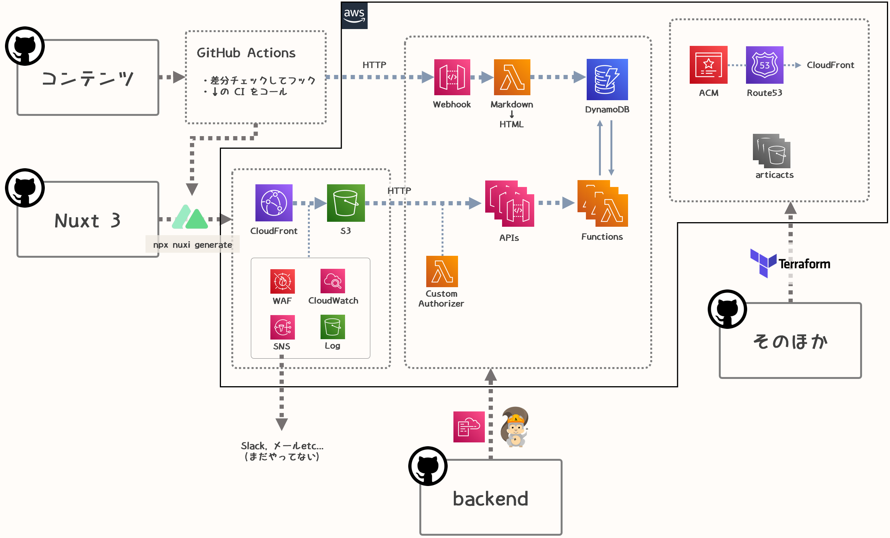
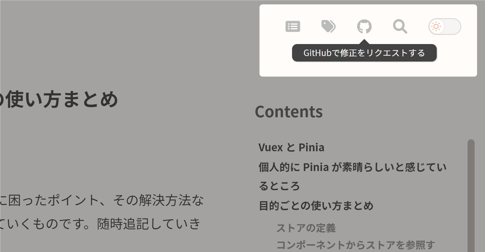

このサイトは

- Nuxt 3
- AWS サーバーレス (by SAM/CloudFormation)
- GitHub によるコンテンツ管理
- 共通インフラ類 (by Terraform)

などで構成されています。

## 全体図



関係するリポジトリが 4 つあり、それぞれのプッシュを起点としてすべてが自動的に機能するようになっています。

クライアント（Nuxt 3 側）：

[https://github.com/mirumirumi/mirumi-tech-frontend]

サーバー側：

[https://github.com/mirumirumi/mirumi-tech-backend]

コンテンツ管理（ `.md` 状態での記事の格納）：

[https://github.com/mirumirumi/mirumi-tech-content]

特定のアプリケーションに限定されない共通インフラ類の管理：

[https://github.com/mirumirumi/aws-common-infrastructures]

継続的に自分が自分のブログで記事を書き続けていくためには徹底的な「仕組み化 for me」が必要だと感じ、まずは

- WordPress からの脱却
- 記事の管理を Git に委ねたい

あたりが大きな目標になっていました。

このタイミングで「Nuxt 3 がいいらしい」という噂をよく聞くようになったので、やりたかったことを全部ひっくるめて実験の第一弾としてみよう！となりました。

つくってみて多すぎるほどの気づきがあったので、運用をしつつメインの雑記ブログではどういう設計にすべきかを練っていこうと考えています。技術ブログレベルなら今の状態で問題なく運営を続けていけそうなので、このサイトはしばらくこの構成でいくと思います。

---

すべての記事がもとのマークダウン状態で GitHub 上に公開されていて、普段のリポジトリと同じように誰でも修正のリクエストができるようになっています。例えば今お読みの本記事も、ページ最上部にある GitHub アイコンから該当ファイルへアクセスできます。



### Nuxt 3

Nuxt 3 はまだ公式リリース前でベータ版状態です。そのため安定しない箇所が多々あり（rc.6 までいっていますが想像以上にまだ安定していないし未実装箇所も多めです…）、この状態でサイトを公開できる状態にまで持っていくのはそこそこの苦労がありました。

<div class="box-common box-rewrite">
<p><span class="rewrite-date">追記 (2022/11/25) ：</span>ようやっと Nuxt 3.0 が正式リリースされたのでこのサイトもバージョンアップさせました。本記事でも当時気になっていたことなどをいくつか書いていますが、現在ではほとんど解決しています（もちろんバージョンアップによる恩恵だけではなく単に自分の知識不足や勘違いが原因だったものもありました）。</p>
</div>

しかしそれはベータ版状態で使っていることに起因しているもので、Nuxt 3 自体の評価に含めてはいけません。むしろ見つけた疑問やバグのようなものは積極的に issue にあげたり discussions に参加したりするようにしました。今回は活発なコミュニティにグローバルで参加していけたのも大きな収穫となりました。

開発していて便利に感じたのは

- 自動インポート
- 便利な composables 集

などでした。

下記のような内容は基本的にすべて書かなくてよいし、

```ts
import { ref, onMounted, watch } from "vue"          // いらない
import { useState } from "nuxt"                      // いらない
import MyGreatComponent from "@/components/TKG.vue"  // いらない

// do something...
```

`useXXX` という Vue 3 のコンポーザブル類も基本的に自動インポートです。しかもこれは Nuxt 3 用の便利コンポーザブルが多数追加されている状態となります。ドキュメントも全然整備されていないのでまだ未知のものも多いのですが、このあとさらに機能実装がラクになっていくでしょう。

個人的にはブログ型のサイトだとしても SPA だけでいいと思っている派なのですが、OGP の問題だけがどうしても解決できないので手をこまねいています。

300 周くらい回って従来のバックエンド側 Web アプリケーションフレームワークか…？とかも思いますが、結局フロントエンド側でモダンな JavaScript を書くならそのエコシステムは無駄にはしたくないし、そもそも API 側はサーバーレスの構造が（自分にとっては）最速＆最強なのでわざわざ他のものを選ぶ理由が見つけられません。

こうなると最後に残るのが結局「クライアント側だけで OGP どうすればいいの」となり「まあせっかくだから Nuxt 3 を使ってみるか」という運びになりました。

今回は一旦満足しています (｡･ڡ･｡)

### API サーバー側

基本的にはいつも通りのサーバーレスの構成を SAM で書いたものではあるのですが、今回は普段なら Terraform で書くようなリソースも CloudFormation 側のテンプレートにまとめてみました。

ネストスタックを使って API 用の関数群とリソースセットを分類しています。

```yaml
Resources:
  FunctionsStack:
    Type: AWS::Serverless::Application
    Properties:
      Location: ./templates/functions.yaml
      Parameters:
        ResourcePrefix: !Ref ResourcePrefix
        EnvironmentName: !Ref EnvironmentName
        AllowedClientOrigin: !Ref AllowedClientOrigin
        UnHashedApiKey: !Ref UnHashedApiKey

  BffStack:
    Type: AWS::Serverless::Application
    Properties:
      Location: ./templates/bff.yaml
      Parameters:
        ResourcePrefix: !Ref ResourcePrefix
        EnvironmentName: !Ref EnvironmentName
```

Terraform に比べると CloudFormation （というか正確には YAML）は書きづらいと思う点は多かったのですが、ちゃんと本腰を入れてリファレンスを読んだりするとまだ知らなかった便利機能があったりとかなり印象が回復しました。

今後もうまい棲み分けを模索していきます。

### そのほか

旧版ブログと比較して、

- ダークモード対応
- シンタックスハイライトを Prism.js に移行
- パフォーマンス的な意味での SEO 改善

などなど明らかによくなったと思える部分もちゃんとあります。

ドメインは新規のものに乗り換えた形ではありますが、301 リダイレクトも行うし Search Console のサイト移行ツールも使うので順位は落ちないと思います。これはメインブログの方で比較的最近に成功しているので不安は全くないです。

あとは新しい仕組みで自分自身がたくさん記事を書いていくのみ！です。

## 既知の問題

リリース前の Nuxt 3 を使ったということも相まって、このサイトの挙動にはやや不審な箇所がいくつかあります。エンドユーザーが実際に気づくケースはそう多くはないと思っていますが、中には明らかに不自然なものも混ざっているのでここであらかじめご紹介しておきます。

### ページ遷移時のスクロール

最も困っているところ。  
よく言われるスクロール位置復元系の話ではなくて、「ページ遷移後にページトップに移動してくれない」というものになります。

Nuxt 2 には scrollToTop という設定があったのですが、いまの Nuxt 3 には類似のものはありません。実装予定かどうかもメンテナーの方からはレスポンスがない模様（参考：[scrollToTop in v3 ?](https://github.com/nuxt/framework/discussions/1661)）。

なので今は暫定的な対応をしています：

```ts
export default defineNuxtPlugin((nuxtApp) => {
  nuxtApp.hook("page:start", async () => {
    window.scrollTo({
      top: 0,
      left: 0,
    })
  })
})
```

少なくともこのサイトを運営していくという意味では最優先で解決したい問題とは思っているのですが、たぶん Nuxt 3 側の対応を待つことになりそうです…。

### ダーク状態の人がページの初期表示をするとき一瞬だけライトモードがちらつく

ほんのわずかな一瞬ではありますが、ダーク状態が表示されるべき人（システム側のテーマ設定がダーク or 右上のスイッチを押してダーク固定になった人）がブラウザで再読み込みした場合、一瞬だけライトモードがちらついてしまいます。

カラースキーマの取得タイミングやその適用タイミングをかなり色々実験してはみたのですが、このアプリケーションを維持したままノータイム実現が叶いませんでした。

- SSG
- ユーザーの認証なし

という 2 つの条件の中でこの課題をクリアするのはとても難しそうだなという印象です。

ちなみにテーマの状態をシステム同期に戻したい方は、このサイトのドメインで発行されている Cookie を消してもらえれば戻ります。

もともとは「システム同期」という選択肢もスイッチに設ける予定だったのですが、見栄えや UI のわかりやすさなどを総合的に考慮してこの設計にしました。一応 1 ヶ月で自動リセットされるようにはなっています。

## おわりに

もし検索からお越しになってその記事がお役に立てたのならば、シェアなどしていただけるととても嬉しいです！  
シェアボタンなどは一切置いていないのですけれども (｡･ڡ･｡)
