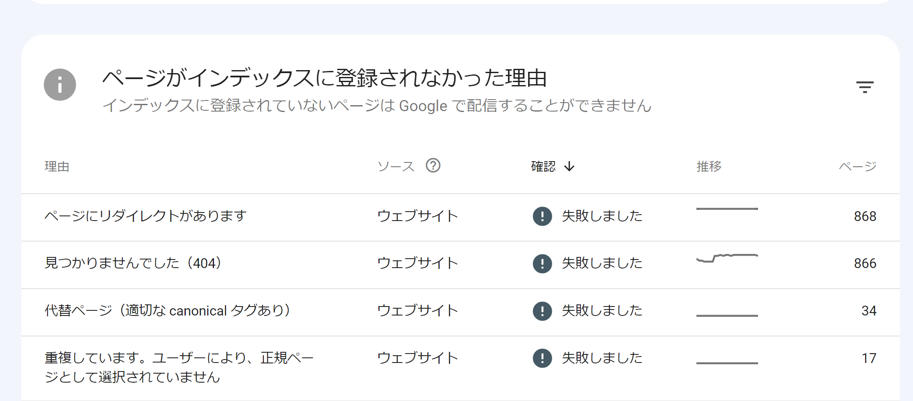

これまで末尾スラッシュなしで運営していたサイトを末尾スラッシュありに変えた場合、主に SEO 的観点で必要なことを記録しておく。サイトの開発に使っている技術スタックによっては予想以上に面倒な可能性もあるので予定されている方はお気をつけて。

末尾スラッシュありになった理由は、SSG で生成したサイトを S3(静的ウェブサイトホスティング) + CloudFront でデプロイしているから。実際にはリダイレクトがかかるのでスラッシュなしのリンクでも問題なく稼働しているように見えたのですが、<strong>Google から見ると末尾スラッシュのありなしは別 URL として扱われるためにサーチコンソール上でとんでもない量の問題が起きる</strong>ことになります（普段 Google はこのような挙動ではないですが、CloudFront が 302 リダイレクトを使っていたり静的ウェブサイトホスティングが独特な仕様であったりすることなどが総合してやっかいな問題となる）。

なので正しくインデックスさせることが必要な対応内容となります。

## 対応の基本方針を調査する

通常の Web サーバーとして動いているサイトにおける末尾スラッシュのありなしはさしたる問題ではないので、そもそも今回のケースはかなり珍しそうです。しかもサイトのページ構成やドメインは変わらないのに末尾スラッシュの有無だけが途中で変わるというのもレアケースっぽい。

調査にはかなり難儀した記憶があるけど、最終的には以下の記事のみを参考にすることにした。

[https://developers.google.com/search/blog/2010/04/to-slash-or-not-to-slash?hl=ja]

記事はとても古いですが、書いてある内容は現代の視点で見ても筋が通っていて納得できるし、この調査におけるクエリに対して Google から出てくる情報が他にないことも見るに、信頼してよい有効な情報だと判断した。

この記事を読んでわかったこと、判断したことは以下です：

- どちらかに統一する必要がある
    - 当然だね
- 301 か 302 かによらず、統一すると決めたほうのタイプの URL が検索結果上でも表示されるようになる
- 仮にリダイレクトがなかったとしても（「重複コンテンツ」がある状態）、望ましい状態ではないが<strong>「全く問題はない」と断言されていることからそこまで神経質になる必要はなさそう</strong>
    - ただしこれは XML サイトマップなどが整備されていてクロール頻度も十分に高いサイトじゃないと実際は困ることになる（後述）
- スラッシュありの URL のほうが一般的であるような印象を記事全体から受けるが、これは現代のウェブ技術から考えると誤謬であると思います
    - 当時はディレクトリを指定しないのならばファイルの拡張子まで表記するのが一般的な時代だった可能性がある（2010 年はさすがにそんな時代でもないとも思うけど…）

## 対応手順

そして、さっきの記事から考えた実際の作業内容は以下です：

- `canonical` を変更する
    - この記事には「`canonical` の指定は 301 と同じ動作になる」と書いてあるが、この仕様がいまも同じかはわからないし、そもそもこのリダイレクトの挙動はこちらで制御できないのであまり関係がない（別の仕組みを用意して 301 させる実験もやってみたが何かがダメでやめた記憶がある、詳細を覚えていない…）
- サイトマップも変更
    - 同じ構成のブログを 2 つ持っていて、ひとつはサイトマップの変更が効いたのかかなり良い状態になったが、サイトマップがもともとなかったほうはサーチコンソール上の問題が収束するスピードが遅く感じた
- サイト内リンクすべての末尾スラッシュ追加
    - クローラーが頼りにする一番のソースがこれなので重要
        - 「これも 302 とはいえリダイレクトされるんだからいいはずじゃん」と普通は思うわけだが、なぜかだめらしい
    - もしアクセス数が少なくてクロール頻度が低いサイトの場合はサイトマップの作成と送信が効く
        - どっちも厳しい状態だとスラッシュありの URL ひとつずつを手動でインデックスリクエストしないといけない（やった）

この対応がどれくらいのスピードで効果があるかは本当にケースバイケースだと思うけど、正しい URL がインデックスされるようになったのはわりと早い段階で確認ができた。最悪手動でリクエストすればちゃんと効くのでまあなんとかなります（サーチコンソールの上部から個別の URL を入力して開くとき、<strong>末尾スラッシュの有無は別のものとして検索されてデータが表示される</strong>ので十分注意してください。僕は最初これに気がつかなくて大量に時間と手間を消費しました）。

ただし、対応したサイトふたつのうちどちらも下記のような表示はまだサーチコンソールに残っている。現在で半年経過くらいです。

でもこれらは「エラー」ではないので特段気にする必要はないということは Google もいろんなヘルプページだのサーチコンソール上の説明だので言っていて、とりあえず時間に任せようかなと思っている。ページエクスペリエンスに関する問題も何もしていないのにエラーになったかと思えば勝手に消えていたりもするし、あまり過敏に反応しないほうがいいというのは昔からの経験則としてある。
