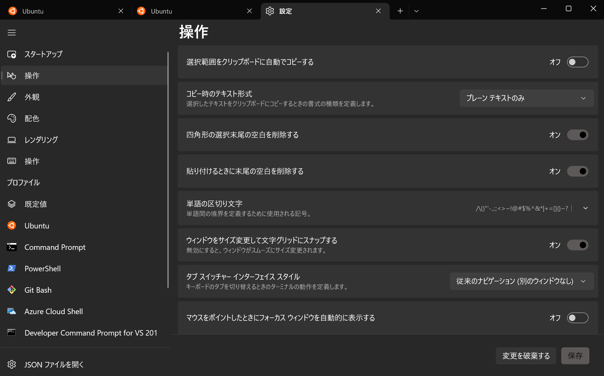
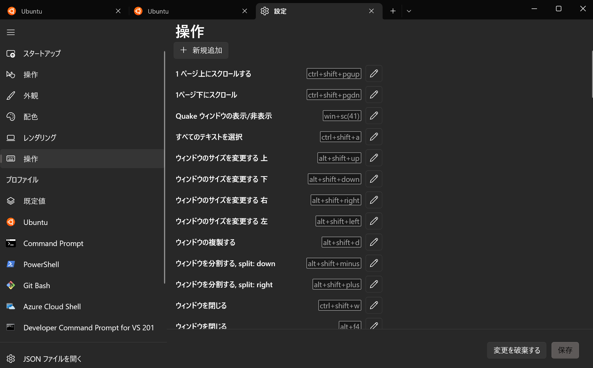
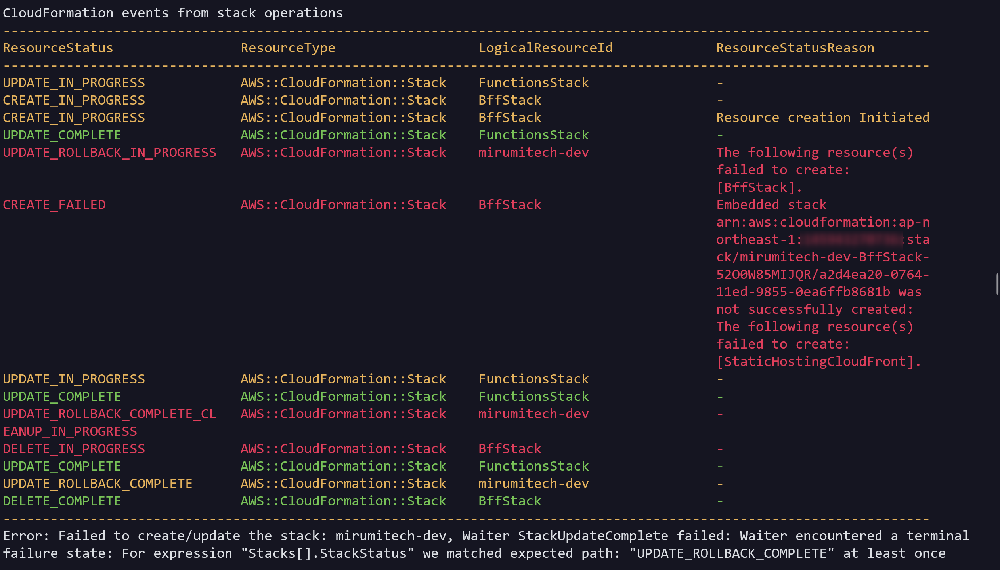
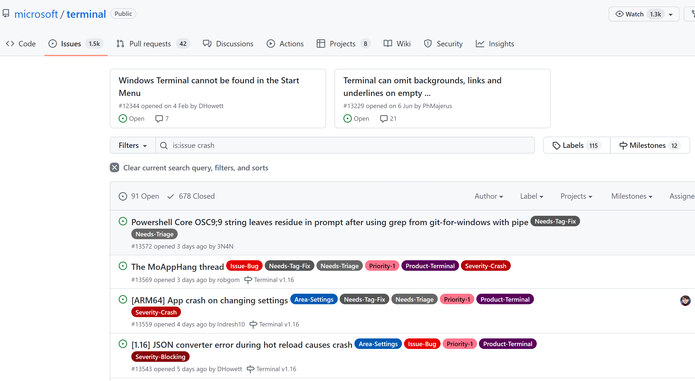
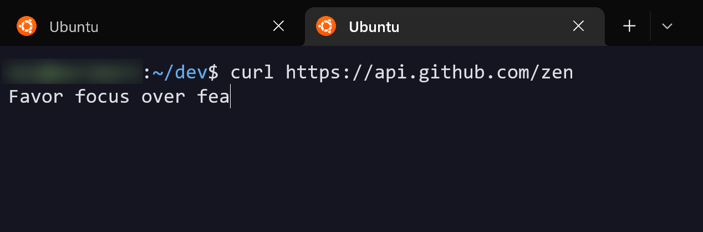
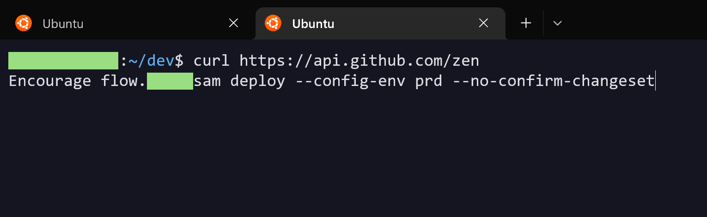

WSL 2 とあわせて Windows Terminal も使い始めて数年経つと思われるので、設定を晒しつつ未だ困っている点についてもまとめてみます。

こちらは WSL 2 とは違い単独のアプリケーションとして開発が進められるものなので不具合改善や新機能追加のサイクルが速く、コミュニティの活動も活発です。気づいた意見があれば積極的に [GitHub](https://github.com/microsoft/terminal) を通じてリクエストしてみる価値が大いにあります。みんなでよいターミナルをつくりあげていきましょう！

## 設定の構造

元来は Windows Terminal の設定は JSON によるコンフィギュレーションだけだったのですが、最近のアップデートでは GUI の整備が積極的に行われておりソフト内で変更できる設定がかなり増えてきました。


*アップデート頻度は非常に高く、毎回毎回気づくと知らない項目が増えているみたいな感じです。*

当然ですが GUI で設定できるものはすべてが JSON で指定できるようになっているので、苦じゃなければ JSON から書くほうが（エンジニアが触るだろうし）ラクです。リファレンスは[こちら](https://docs.microsoft.com/ja-jp/windows/terminal/customize-settings/startup)。

## 設定を晒す会

晒すといっても JSON だけ全部貼り付けたりしても記事としてはなんにも面白くないので、いくつかピックアップして紹介したいです。キーボードオタクなのでホットキーに関する設定が異様に多いのですが適度にスキップします。

### メインの Linux (Ubuntu) のプロファイル設定

まずは WSL 2 のメインとなる Linux プロファイルの設定です。

言い忘れていましたが、Windows Terminal を使う大きな動機に「WSL(2) を使いたいから」というのがあると思います。ネイティブに統合されたシームレスな開発体験を得られます。

以下がプロファイルの定義部分です。

```json
{
    "guid": "{2c4de342-38b7-51cf-b940-2309a097f518}",
    "hidden": false,
    "historySize": 99999,
    "icon": "D:/\u305d\u306e\u4ed6/ubuntu.png",
    "name": "Ubuntu",
    "padding": "11",
    "source": "Windows.Terminal.Wsl",
    "startingDirectory": "\\\\wsl$\\Ubuntu\\home\\[username]\\dev",
    "suppressApplicationTitle": true,
    "tabTitle": null
},
```

設定の種類の紹介ついでに 1 つずつ紹介します。

項目|説明
---|---
guid|プロファイルを識別するユニークな ID。ただの UUID ですが、生成して実際に適用させるには PowerShell で `[Guid]::NewGuid()` というコマンドを実行する必要があります。
hidden|新規タブを開くときのプロファイル一覧に表示させるかどうか。デフォルトで削除できないゾンビプロファイルがあるので（Azure Cloud Shell とか Azure Cloud Shell とか）、主にこれを隠すのに使います。
historySize|コマンドの履歴をどれくらい保存させるか。PC の能力に自信がある人はとりあえず大きくしておけばいいと思います。
icon|タブに表示されるファビコンのようなもの。好きな画像を使えます。Windows 側に置いてあるファイルも指定できます。
name|プロファイル名の指定。
padding|コマンドとウィンドウのフレームの間にどれくらい余白を設けるか。
source|シェルの本体の指定。WSL 2 の場合は `"Windows.Terminal.Wsl"` と書くとデフォルトに指定しているディストリビューションが起動します。
startingDirectory|プロファイルのデフォルトスタートディレクトリ。複数用意したい場合は同じシェル指定で異なる GUID を用意するか、もしくは後述する起動後にスクリプトを実行する仕組みを利用する必要があります。
suppressApplicationTitle|Windows Terminal のウィンドウ自体のタイトルをシェルの状態によって自動的に書き換えられるのを防ぎます。`true` で抑制する状態です。
tabTitle|タブのタイトルに関する設定です。`null` だとなにも置き換えずプロファイル名のまま、`name` にするとシェルごとに異なった挙動になります（[詳細](https://docs.microsoft.com/ja-jp/windows/terminal/tutorials/tab-title#use-the-tabtitle-setting)）。

### 全体共通設定

JSON のスキーマでいうところのルート階層（`profiles` と同じ階層）には全体に適用される一般設定を書くことができます。いくつか紹介します。

```json
{
    "confirmCloseAllTabs": false,
    "copyFormatting": "none",
    "copyOnSelect": false,
    "defaultProfile": "{2c4de342-38b7-51cf-b940-2309a097f518}",
    "initialCols": 123,
    "initialPosition": "771,271",
    "initialRows": 33,
    "multiLinePasteWarning": false,
    "startOnUserLogin": true,
    "startupActions": "new-tab -d \\\\wsl$\\Ubuntu\\home\\[username]\\dev\\ ; new-tab -d \\\\wsl$\\Ubuntu\\home\\[username]\\dev ; focus-tab -t 0",
    "tabSwitcherMode": "disabled",
    "tabWidthMode": "equal",
    "theme": "dark",
    "windowingBehavior": "useNew",
}
```

項目|説明
---|---
confirmCloseAllTabs|すべてのタブを閉じるときの確認を `false` で抑制します。
copyFormatting|`"none"` でコピーするときの書式をコピーから除外します。
copyOnSelect|テキスト選択をすると自動的にコピーがされますが、それを `false` で無効化しています。
defaultProfile|デフォルトのプロファイルを指定します。先ほどの Ubuntu と一致しているはずです。
initialXxx|ウィンドウ位置とサイズの指定です。
multiLinePasteWarning|複数行の貼付けで警告が出るのを `false` で無効化します。
startOnUserLogin|スタートアップ起動のようなもの。`true` で有効化です。
startupActions|起動時の自動実行スクリプトを書ける今のところ唯一のエントリーポイント。しかし実行できるコマンドの種類はかなり少ないので自由度は少ないです（[リファレンス](https://docs.microsoft.com/ja-jp/windows/terminal/command-line-arguments?tabs=windows)）。僕はメインディレクトリをとりあえず 2 つ開くようにしていて（そのあと 1 つめのタブにフォーカス）、各プロジェクトごとにここ自体を書き換える別の仕組みと併用しています。
tabSwitcherMode|タブスウィッチャーという機能を `"disabled"` で抑制しています。ちょっと小窓が出るアレです。
tabWidthMode|タブ幅をどう割り付けるかの設定です。僕は均等にしています。
theme|テーマ。
windowingBehavior|新しいインスタンス（ウィンドウと思えば OK）を開くときの挙動を指定します。`"useNew"` は常に新しいウィンドウで開くような指定です。

### ホットキー類

僕のポリシーは「すべての OS、デバイス、アプリケーションで徹底的に同じキー操作をできるようにする」です。これが 1 つでも叶わない場合には全ての利用を取りやめるくらいこの鉄の意志で普段から生活しています。

幸い Windows Terminal はホットキーに関しては初期から設定項目が豊富で、いまも順調に増え続けているので特に困ったことはないです。

具体的な紹介はしないですが、タブに関する操作は普段のターミナルの利便性を大幅に上げるので細かく設定するのをおすすめしたいです、個人的には。


*これは GUI から行うのがいいかもしれませんね。*

### 外観

普段はソフトの見た目にこだわらない人もターミナルの外観にはこだわる方が多いですよね。Windows Terminal はこのあたりかなり許容度が高いです。背景の透過やブラー、タブスプリッティング（1/2、1/4、上下左右など色々）、ハイライトカラーの細かい指定などなど自由度は文句ありません。

僕は全体的にこんな感じです。



## 不満点まとめ

使い始めた初期からずっと実現したい機能がいまだにうまくいかなかったり…みたいな内容、その他不具合等をまとめています。

…と言いつつ、実はこの記事は僕の記事ネタリストにこれまた数年レベルで存在し続けていたのですが、当初メモっていた不満点のうちほとんどは改善されてなくなっていってしまいました。いいことなのにちょっと寂しい。

というわけで今残っているのは数個程度です。

### 勝手に落ちることがある（最近ほぼなくなりました）

常用するアプリケーションで、しかもシェルを制御するソフトで「勝手に落ちることがある」というのはあまりにも致命的です。

昔はこれの発生頻度がそこそこだったのでストレスも多く、必死で乗り換え先を探したこともありました（でも Windows で使えるターミナルで Windows Terminal 以上のものはないという結論に結局戻ってくる…）。

とはいえさすがにこの問題は重要視されているようで、最近はもう全く遭遇していません。最後に落ちたのはいつだかわからないくらいです。

報告例も多く、リポジトリ内で「crash」と検索すると大量にヒットするものがあります（もちろん関係のないクラッシュも混ざっていますが、ピックアップするのが大変だったのでなんとなくのイメージがわかるだけでもと思って書いています）。



これが起きるからこそなおさら次に書く「タブやセッションを復元したい」というニーズも強くなっていたのですが、幸いこの悪い相乗効果はなくなってきました。

### タブの復元（セッションの復元）

ここでいう「セッション」とはだいぶ甘い定義なのですが、要は

- 各タブと作業ディレクトリ位置
- 使っていたコマンド履歴
- できれば出力履歴も

などが再起動時にも復元されてほしいということです。

「複数タブを開いてそれぞれの作業をそれぞれのディレクトリで行う」というのはごく一般的なユースケースだと思うのですが、これが PC 再起動のタイミングなどで毎回リセットになるのはいささか困ります。

Mac の有名ターミナル [iTerm 2](https://iterm2.com) はもとより、標準ターミナルでさえタブの復元および次に書くセッションの復元が可能です。Windows 側の代表としてここだけはなんとか純正の標準機能で対応してほしいなと願っています。

前述した `startupActions` でせいぜいオリジナルプリセットを使えるのが現実的な範囲では精一杯ですが、「Windows Terminal restore tabs」などでググると多くの人がオリジナルの工夫をしているサマは見えます。ずっと調べてきていますが結局純正の実装を待ちたいタイプなので僕はもう今はなにもやっていません…。

### 「↑」でコマンド履歴を辿るとき表示がバグることがある

これは Windows Terminal が直接の原因なのかは正直よくわかっていないです。issue を出すほどでもないのでちゃんと検証したことはないのですが、もし体験談などありましたらご報告いただけると嬉しいです。

問題の概要は、



こうやって普通の `curl` コマンドを送信したあと（たまたま `curl` は自分の環境で再現性があることを知っている）、

そのまま<span class="key">↑</span>キーを 2 回押すと、



ターミナルの「ユーザー名@マシン名」の部分や前回の出力部分に食い込んで表示がめちゃくちゃになります。名前部分を塗りつぶさせてもらっている関係で症状がだいぶわかりにくくて申し訳ないのですが…。

前回のコマンドをコピーしたいときや、一部だけ編集して再実行したいときはさらにカオスなことになり、結局リセットしないといけなくなります。

どなたこの症状に見覚えある方っていますか…？

## おわりに

これまで「ソフトウェア開発なら Mac」と言われてきた理由には色々なものがありますが、これまた色々な理由によってその牙城は崩れてきています。

その１つには間違いなく「Windows でも便利でメインユーズできるターミナルソフトが登場したから」があるでしょう。

自分の最近のソフト選びの趣向が「ネイティブよりなものを選ぶ」になってきたのもあって、Windows 純正 UI （正確には WinUI と呼ばれてきているもの）が採用されている Windows Terminal もデザイン含めて気に入っています。Windows 11 からウィンドウが角丸になったのも非常によい効果を生んでいると思います。


*実は角丸に加えて box-shadow 的なものも付加されていて、UI の全体的な質感は Windows 11 で本当に向上しました。*

致命的な不具合もほぼなくなってきたこともあり、今後はプラス方向にしかいかないくらいに思っています。よければみなさんもぜひどうぞ。
