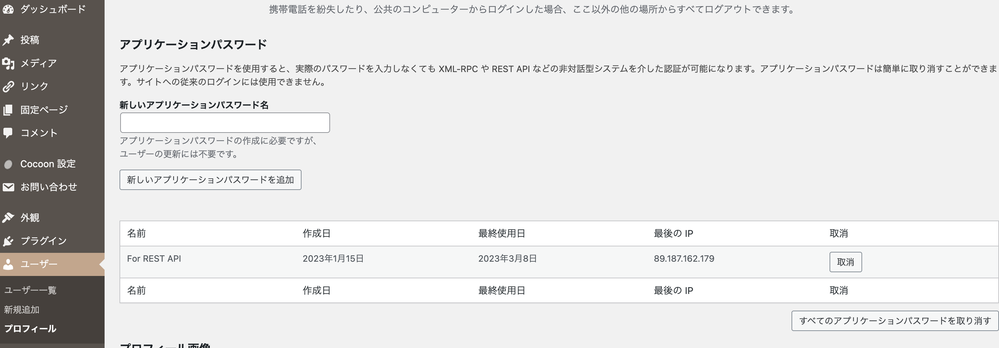

WordPress の REST API を使ってフル SSG なサイトをつくったとき、びっくりすることに GET 系以外のリクエストをするための認証方法について最新でのノーマルパターンというのが一体なんなのかすぐに判断できなかったため、使い方とともにメモに残しておく。

## 認証方法：Application Passwords

要は Bearer トークン方式であり、実際のリクエストもそのようになります。

先にリクエストイメージ（詳細は後述）。

```ts
await $fetch(`/wp/v2/comments`, {
  baseURL,
  method: "POST",
  headers: {
    "Authorization": `Basic ${window.btoa(userName + ":" + applicationPassword)}`,
  },
  body: {
    content: "I like a mikan."
  },
})
```

WordPress 的には「登録ユーザーの誰かに紐付いて特定の権限を付与した形で生成するパスワード」なので、認証機能そのもの（認可ではなく操作ユーザーの判別も可能）という感じに見える。

もちろんのこと、漏洩するとコンテンツを消されまくったりされかねないので管理は厳重に行う必要があります。権限の設定は<strong>紐付いている Application Passwords のユーザーのものが適用されるのみで、生成段階で細かい制御はできない</strong>ので十分注意してください。

例えば認証が必要になるほとんどのケースはコメント投稿などであると思われますが、これは「購読者」という一番弱い WordPress の権限でも問題なく使用できます。

また、Application Passwords だけではなくユーザー名もブラウザから見えてしまうことに注意してください。これらをまとめると、新しく「購読者」権限で作成したユーザーにのみ Application Passwords を設定するのがよいということになるでしょう。

### Application Passwords の取得方法

WordPress 管理画面から [ユーザー] → [プロフィール] → [アプリケーションパスワード] です。



形式は半角スペースを含む `vdi7 hAIo 96P0 CeJ7 6rZZ 103a` などのもので、これをそのまま次の手順に持っていきます。

### リクエスト方法

なぜかリクエスト方法の公式な説明が全然見つけられず、わりと試行錯誤して答えを探すという感じでした。試すべきパターンはそんなに多くないのでそこまで苦労しませんでしたが。

ヘッダーでのトークンの使用について、ポイントは以下です：

- ヘッダー名は `Authorization`
- ヘッダーの値の冒頭には `Basic ` を付与する（`Bearer ` ではない）
- トークン本体は base64 エンコードする必要がある
- Application Passwords 本体の前に `username:` をつける必要がある
    - ここでのユーザーネームとは WordPress の管理画面でいう「ユーザー」ページの一覧に並んでいる ID の部分のことです（多くはログインするときに使っているものと同じはず）

です。

一度生成したトークンは特に更新したりする必要はないので、（安全性と引き換えではありますが）楽といえば楽でした。
