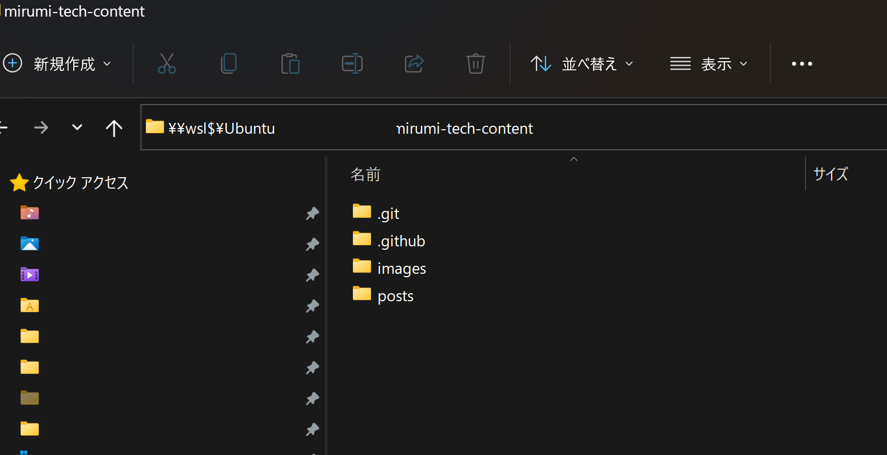
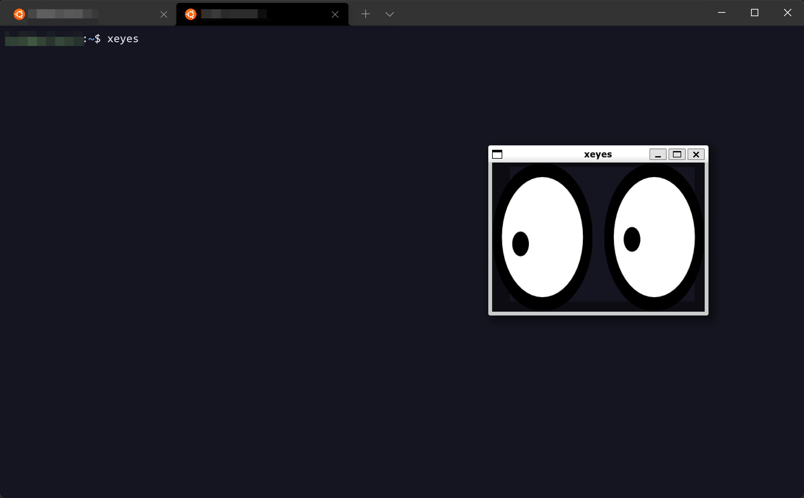
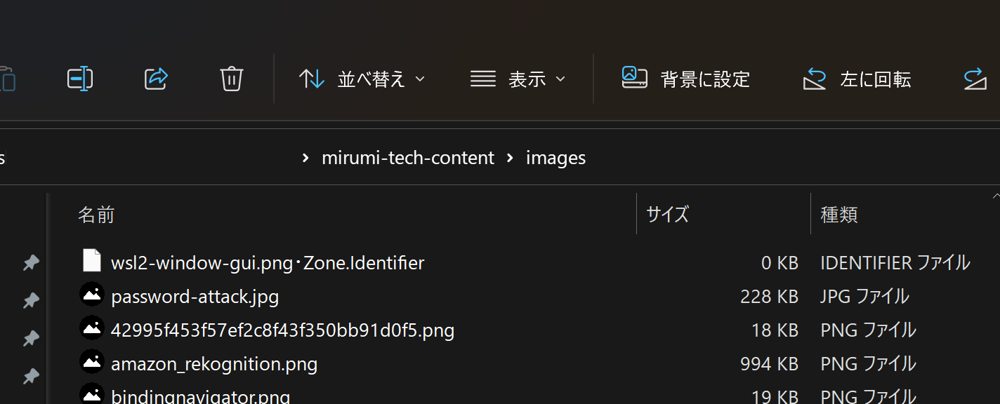
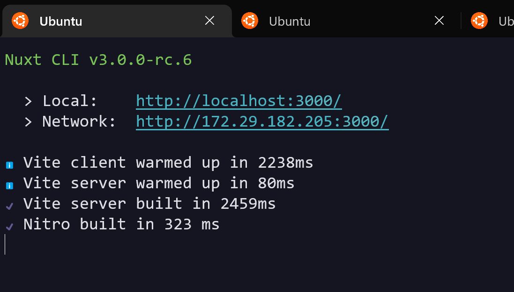
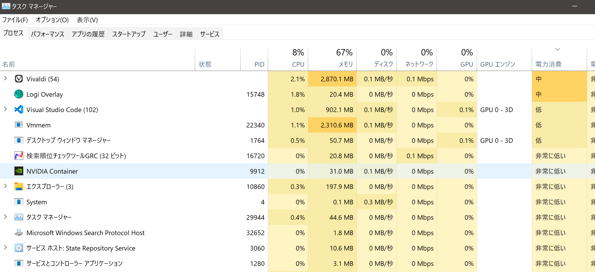

個人開発の環境を WSL 2 にしてからかなり経ちました。具体的にいつからか思い出せないのですがたぶん数年は使っています。

途中で Windows 11 が WSL 2 をより標準に取り込もうとするアップデートがあったり、ここ最近で使い勝手は大きく向上しました。というわけでそろそろ色々まとめておこうという感じ。随時追記します。

WSL 2 の話をするときは [Windows Terminal](https://github.com/microsoft/terminal) の存在がどうしても切っても切れないものになるのですが、話がややこしくなるので本記事の範疇からは外すものとします。~~のちに別記事を書く予定です。~~ →書きました。

[/windows-terminal]

## 良いところ

よいところは実はあまりない、いや、正確に言うなら **WSL 2 を使おうとする動機は過不足なくほぼちゃんと満たされる**ということになります。

間違いなく大目的は「Windows のマシン上で Linux(Unix) 環境を動かしたい」であるはずですが、これ自体ももちろんですしそれに付随する多くの開発ニーズもちゃんと実現してくれます。この時点でとてもすごいことであり、初めて触ったとき大きな感動があったことだけは覚えています。

というわけで必然的に「良いところ」で書く項目数は少なくなってしまうのですが、「総じて悪い」という意味ではないことには留意ください。最後にも書きますが、僕は今後もぜひメインの開発環境で使っていきたいと思っているレベルです。

### ファイル管理をエクスプローラーで行える

これは上級者の方ほど理解してもらえないことなのかもしれないけれど、ファイルやディレクトリの閲覧/管理をいつものエクスプローラーで行えるのはやはり便利に感じます。

WSL 2 内へのデータには Windows 側で使う通常のファイルパスと同等な扱いでアクセスが可能で、つまりはエクスプローラーでも開けるということになります。



ただしこのメリットでは同時に「ファイル表示のリアルタイム同期が不完全」という問題に気づくことにもなります。後述します。

### 複数の Linux 環境を同時に扱える

これが WSL 2 自体のメリットなのかと言われると少しだけ区分が怪しい気もするのですがまあいいでしょう。Windows Subsystem for Linux なので、「Windows 上で扱える Linux 群の仮想環境」という意味では合ってそうです。

普段の開発でいくつも Linux ディストリビューションを切り替えることは多くはないですが、例えば RedHat 系 と Debian 系を切り替えたいことはありそうですし、テスト環境のように使うこともできなくはないです（ややめんどいけど）。

上述した通りファイルパスにもディストリビューション名が含まれるのでこれも便利です（例： `\\wsl$\Ubuntu\home\[username]\dev` ）。

### VSCode 対応

書く場所に迷ったのでここに入れてしまいます。

ターミナル含めて VSCode とほぼ完璧に統合されています。[Remote - WSL](https://marketplace.visualstudio.com/items?itemName=ms-vscode-remote.remote-wsl) という拡張機能を使うことで WSL 用のウィンドウを開くことができるようになり、通常の開発となにひとつ変わらないレベルでごく自然に扱えるようになります。ローカル側（Windows）と織り交ぜて使用することももちろんできます。

問題再現のための最小構成などをさっとディレクトリから

```shell
code .
```

で開いてその VSCode 上で即ターミナルを扱えるのはとても便利です。

あと僕は Git は VSCode 上では使わないですが、これも統合できます。

## 悪いところ

最初にも書いたとおり、どちらかというとこの記事のメインはこっちになります。僕としては「あとここさえ改善されれば…！」という最後のひと押しくらいなイメージです。

### エクスプローラー上でリアルタイムにファイル同期されない

エクスプローラー上で Linux 環境を気軽に覗けるのはいいのだけど、「インターネットから画像をダウンロードして保存」みたいなことをしたあとにエクスプローラーがリアルタイムに同期しないのはちょっと不便さを感じます。

データ自体はちゃんと反映されているのでファイルウォッチャーの仕組みに問題があるというわけではなく、あくまでも「エクスプローラーの表示がリアルタイムに同期されない」ということのようです。

ちなみに VSCode 上ではこの問題は発生しないので普段の開発ではほぼ困るシーンはないです。

### GUI を伴う開発

開発環境が Linux 側にあるということは画面描画を伴う開発の場合は [X 11](https://www.x.org/wiki/) などのウィンドウシステムが必要であることを意味します。

これは仕組み上 WSL 初期から最も大きな弱点だったと思われます。設定が面倒な上に落とし穴も多く、がんばって成功しても画質は粗いしカクカクするし…で実開発にはまだ耐えないです。

Windows 11 になって以降大きな進歩があって、特段の設定がなくともほぼ標準状態でウィンドウシステムを動作させることができるようにはなりましたが、例えば Electron のアプリケーションをこれで作れるかと言われたら僕は無理なレベルだと思います。


*Windows 10 までの設定の面倒くささに比べたらこの手軽さは感動しましたが、ウィンドウフレームなどはさすがに Windows ネイティブのものにはならないのでデスクトップアプリケーションの GUI 開発などはまだ厳しいです。*

これは人によっては一切用事がない要件の可能性もあるのでデメリットとしては大きくない…という考え方もあるかもしれません。そもそも仕組み的にそういうもの、という気もします。

### Zone.Identifier は敵

WSL を触ったことない方は初めて見る文字列かもしれません。

下記のようにファイル名末尾に `・Zone.Identifier` (注：`・` は実際には なかぐろ ではないが直接貼り付けると文字化けしてなんの文字かわからないため手動で表記)とついた謎のファイルが生成されるという問題です。



Zone.Identifier とは Windows のセキュリティに関する仕組みのひとつで、インターネットからダウンロードしてきたファイルに「ゾーン」という分類でなんらかの識別をしてメタデータ付けを行うものです。

あまり情報が多くなくてちゃんと理解できていないのですが、概ね「普段の Windows でも動作している仕組みだけど隠蔽されていて僕らが意識することはない、ただし WSL 上だと露呈してしまう」などのように思っています。

少なからず

- グローバルに gitignore しておく
- VSCode のファイルツリーから exclude しておく

などの設定はおすすめしたいところ。ファイルが存在していても実害はないです。もちろん削除しても問題はありません。

こういう変なものが混ざっていても気にならないタイプの方には大したデメリットにもならないでしょう（エンジニアにそんなタイプいるのか…？）。

### localhost のネットワークモードをそのままでは使えない

これも困る量や頻度でいったら小さいものですが改善したら嬉しい系です。

主にウェブ開発で使用されるようなフレームワークの多くは

```bash
xxx run
```

などで dev サーバーを起動して普段の開発を進めるでしょう。

この場合 localhost:3000 などが使用されるか、もしくはフレームワークによっては特定の IP アドレスでも開けるネットワークモードが使用できる場合があります。


*これは Nuxt 3 の開発サーバー起動画面。「Network」と書かれているほうがいわゆるネットワークモードです。*

これは自分の他のデバイスからもアクセスできるようになるために主にレスポンシブデザインの確認などで重宝しますが、WSL 2 では基本的にこれが使用できません。

WSL 2 は閉じたネットワーク経路を利用して Windows 側とのやりとりを行っています。なので WSL 2 の中で単体のローカルネットワークが存在しているような構図になり、つまりは Windows 側の世界とは完全に独立しているイメージになります。

こうなると上図に表示されているような `172.29.182.205:3000` にアクセスしようが当然外の世界からはなにもできないことになります。…というのが問題の概要です。

WSL 1 ではネットワークブリッジを使用することで比較的手軽に対応ができたのですが、WSL 2 では毎回ランダム(？)に Windows 側とのネットワーク経路が決定するために少なからず「毎回お手製スクリプトを実行する」みたいなことをやらないと回避できないです。

さすがにこの問題は GitHub 上でも多くのリクエストが行われていますが、根本の仕組み上すぐに解決できるものではないので数年レベルでずっと Open な感じになってます（例えば [これ](https://github.com/microsoft/WSL/issues/4150)）。

僕はわざわざややこしい設定や運用方法を決めてまでこれを解決したい動機がないので特になにもしていない（レスポンシブ確認などは本番デプロイして実機確認する）ですが、もし改善されたらとても素晴らしいですよね。

### 貧弱な PC ではメモリ不足で厳しい

これは多くの方にとって問題になるだろうと思って書いていますが、僕はもう忘れていたくらいです。

WSL 2 を起動すると「Vmmem」というプロセスもタスクマネージャー上に現れますが、こいつがメモリを怪獣のように食いまくってしまうことが正式リリース後も長らく問題視されていました。


*いま撮影してみたスクリーンショットだと上から 4 つめにいます。*

で、そのとりあえずのワークアラウンドとして WSL 2 は「その PC のメモリの 50% か 8GB、いずれかの量が少ない方までは目一杯使われる可能性がある」という仕様になっています（[参考](https://docs.microsoft.com/ja-jp/windows/wsl/release-notes#build-20175)）。

これはつまり「メモリが 16GB 以下の人は常に 8GB 持っていかれるかも」ということを意味しており、他の作業を邪魔する十分なパワーがあります。

まあでもこれ、要は**お金で解決できます**。最低でもメモリを 32GB にすることによって普段の開発で困ることはなくなるでしょう。

みなさん、ゲームのためにグラボの価格をウォッチする前にメモリを足しましょう。

## 今後の開発環境戦略

まとめると、「デスクトップアプリケーションの開発以外では実行力のある問題はあまりなさそう」ということになります。

しかもデスクトップアプリケーションといっても、例えば .NET など Windows 系のアプリケーション開発をするならそもそも Visual Studio を使うでしょうし、Mac アプリなら言わずもがな Mac を使っているはずです。スマホアプリも各統合開発環境の中でエミュレーターシステムが存在していますね。

なので開発人口がそこそこ多くて独自のウィンドウシステムを持ち得るものとなるとそんなに多くないのではと思っています。

このあたりを色々総合すると、個人では今後も Windows + WSL 2 をメインで使っていこうという結論になります。しかし「自分が好きなだけでお金を出せるデスクトップ PC があるなら」という条件つきになり、つまりは会社で「Windows/Mac を選べます」と言われたら迷わず Mac を取ります（現在もそうしています）。ラップトップの場合はキーボード配置が僕にとっては死ぬほど重要ですし、そもそもハードウェア本体の性能が Windows 系ではいまの Mac には遠く及ばないためにストレス量もすごそうです。

参考になりましたら幸いです！
